# Assignment 1 Report

## KNN

### Task 1: Exploratory Data Analysis

The suitable plots for given spotify dataset are following.
1. Histogram of the numerical features
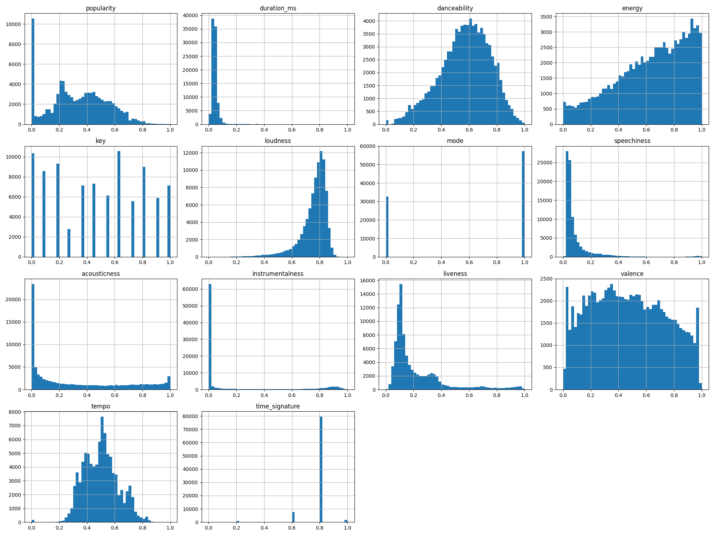
From histogram I can see that the key and mode are not contributing much to the prediction. Hence I can remove them from the features. The other features are contributing to the prediction. The numerical features are not normally distributed. The numerical features are skewed. The numerical features are not on the same scale. Hence I can normalize the features to get better accuracy.
2. Boxplot of the numerical features
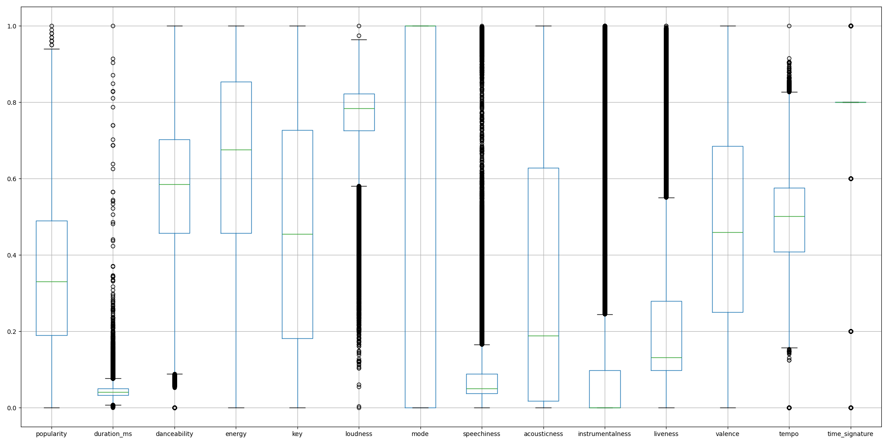
The similar inference can be drawn from the boxplot as well. 
Here we can see that the box of mode is very large for only two descrete values. Hence it is only giving the binary information for a 144 distinct genres. Similarily only few distinc values of keys are present. 
From the box plot we can comment on outliers. The outliers are present in the almost every feature.
3. Violin plot of the numerical features
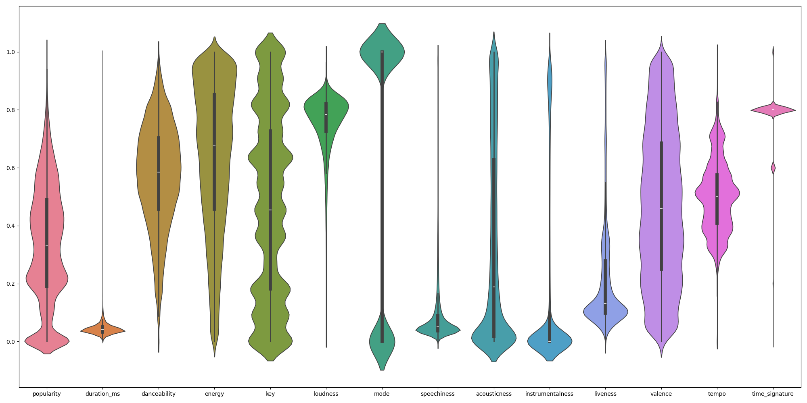
The violin plot is also showing the distribution of the features. The features are not normally distributed. The features are skewed. The features are not on the same scale. Hence I can normalize the features to get better accuracy. (The same inference can be drawn from the histogram and boxplot as well)
4. Pairplot of the numerical features
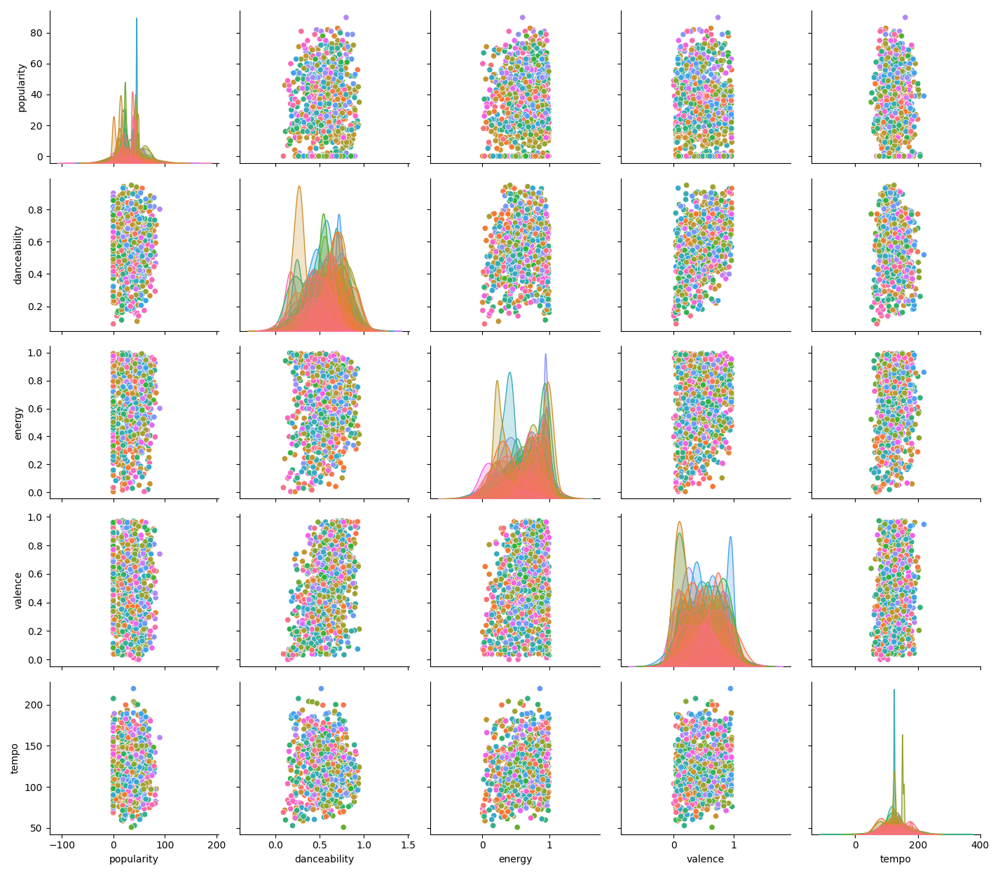
In pair plot I have plotted the features which are actually contributing to the prediction(inference from histogram). The pair plot is showing the correlation between the features. The features are not linearly correlated. The features are not normally distributed. The features are skewed. The features are not on the same scale. Hence I can normalize the features to get better accuracy.


Similar to key and mode, the time_signature is also not contributing much to the prediction. Hence I can remove it from the features. For current implementation I have only removed key and mode.

### Task 2: KNN Implementation

#### Part 1 & 2

```python
import numpy as np

class KNN:
    def __init__(self, k):
        self.k = k

    def fit(self, x_train, y_train):
        self.x_train = x_train.to_numpy()
        self.y_train = y_train.to_numpy()
        self.norm_x_train = np.linalg.norm(self.x_train, axis=1)
        
    def predict(self, x_test, distance_metric='euclidean'):
        y_pred = []
        x_test = x_test.to_numpy()
        for x in x_test:
            y_pred.append(self.predict_one(x, distance_metric))
        return np.array(y_pred)
    
    def predict_one(self, x, distance_metric):
        if distance_metric == 'euclidean':
            distances = np.sqrt(np.sum((self.x_train - x) ** 2, axis=1))
        elif distance_metric == 'manhattan':
            distances = np.sum(np.abs(self.x_train - x), axis=1)
        elif distance_metric == 'cosine':
            # For this looked up online resourses for how to calculate cosine distance efficiently
            dot_product = np.dot(self.x_train, x)
            norm_x = np.linalg.norm(x)
            cosine_similarity = dot_product / (norm_x * self.norm_x_train)
            distances = 1 - cosine_similarity

        # For this also looked up online resourses for how to get k nearest neighbours efficiently  
        nearest_indices = np.argpartition(distances, self.k)[:self.k]
        nearest_labels = self.y_train[nearest_indices]      
        index, counts = np.unique(nearest_labels, return_counts=True)
        return index[np.argmax(counts)]
```

In this class I have implemented the fit method to store the training data and labels. The predict method is implemented to predict the labels of the test data. The predict_one method is implemented to predict the label of a single test data. The distance metric can be 'euclidean', 'manhattan' or 'cosine'. The cosine distance is calculated using the formula 1 - cosine similarity. The k nearest neighbours are calculated using the np.argpartition method. The label with the highest frequency is returned as the predicted label.

I also looked up some online reources to implement the cosine distance and to get the k nearest neighbours efficiently.

This model is stored in at path `models/knn/knn.py`.

#### Part 3 Score Calculation

```python
import numpy as np

class Scores:
    def __init__(self, y_test, y_pred):
        self.y_test = y_test
        self.y_pred = y_pred
        self.accuracy = np.mean(y_pred == y_test)
        self.createConfusionMatrix(y_test, y_pred)
        self.calculateMicroScores()
        self.calculateMacroScores()

    def createConfusionMatrix(self, y_test, y_pred):
        test_unique = np.sort(np.unique(y_test))
        matrix = np.zeros((len(test_unique), len(test_unique)))
        for i in range(len(test_unique)):
            for j in range(len(test_unique)):
                matrix[i, j] = np.sum((y_pred == test_unique[i]) & (y_test == test_unique[j]))
            
        self.confusion_matrix = matrix

    def calculateMicroScores(self):
        TP = np.diag(self.confusion_matrix)
        FP = np.sum(self.confusion_matrix, axis=1) - TP
        FN = np.sum(self.confusion_matrix, axis=0) - TP
        precision = np.sum(TP) / np.sum(TP + FP)
        recall = np.sum(TP) / np.sum(TP + FN)
        f1 = 2 * precision * recall / (precision + recall)
        self.micro_precision = precision
        self.micro_recall = recall
        self.micro_f1 = f1

    def calculateMacroScores(self):
        precision = np.zeros(self.confusion_matrix.shape[0])
        recall = np.zeros(self.confusion_matrix.shape[0])
        f1 = np.zeros(self.confusion_matrix.shape[0])
        for i in range(self.confusion_matrix.shape[0]):
            TP = self.confusion_matrix[i, i]
            FP = np.sum(self.confusion_matrix[i, :]) - TP
            FN = np.sum(self.confusion_matrix[:, i]) - TP
            if (TP + FP) != 0:
                precision[i] = TP / (TP + FP)
            else:
                precision[i] = 0
            if (TP + FN) != 0:
                recall[i] = TP / (TP + FN)
            else:
                recall[i] = 0
            if (precision[i] + recall[i]) != 0:
                f1[i] = 2 * precision[i] * recall[i] / (precision[i] + recall[i])
            else:
                f1[i] = 0
        self.macro_precision = np.mean(precision)
        self.macro_recall = np.mean(recall)
        self.macro_f1 = np.mean(f1)
```
Note: I have taken help with Copilot for efficient implementation of the score calculation.

In this class I have implemented the score calculation for the classsification problems.The createConfusionMatrix method is implemented to create the confusion matrix. The calculateMicroScores method is implemented to calculate the micro scores. The calculateMacroScores method is implemented to calculate the macro scores. The precision, recall and f1 scores are calculated using the formulas provided in the assignment.

To get TP, FP and FN, I used the basic definitions of how these are calculated with the confusion matrix. 

This class is stored in at path `performance_measures/knn_score.py`.


### Task 3: Hyperparameter Tuning

#### Part 1 & 2
For this first I have splitted the dataset in (80:10:10) ratio for training, validating and testing.

For hyperparameter tuning I have used the validation set. I have used the validation set to find the best value of k and distance metric. I have used the accuracy as the metric to find the best hyperparameters.

The best hyperparameters vary for different runs as I am suffling the data before splitting. But the most common best hyperparameters are k = 20 and distance_metric = 'manhattan'.

The top 10 pairs of hyperparameters are following.

```
Top 10 pairs
(acuracy, (k, distance_metric))
(28, (10, 'manhattan'))
(28, (20, 'manhattan'))
(28, (30, 'manhattan'))
(28, (40, 'manhattan')) 
(28, (50, 'manhattan')) 
(28, (60, 'manhattan')) 
(28, (70, 'manhattan'))
(28, (80, 'manhattan')) 
(28, (90, 'manhattan'))
(26, (10, 'euclidean'))

Best k: 10
Best distance metric: manhattan
```
```
Accuracy for test data for best k: 10 and distance metric: manhattan is 27.220055710306408%

Scores
Accuracy: 0.27220055710306407
Micro Precision: 0.27220055710306407
Macro Precision: 0.26234777109013585
Micro Recall: 0.27220055710306407
Macro Recall: 0.2516766863258148
Micro F1 Score: 0.27220055710306407
Macro F1 Score: 0.24822893866761822

```

#### Part 3
For plotting the k vs accuracy graph I have used 10 different values of k ranging from 10 to 100 for each distance metric. The accuracy is calculated for each value of k and plotted.

K vs Accuracy for different distance metrics are following.

1. 
    Manhattan
    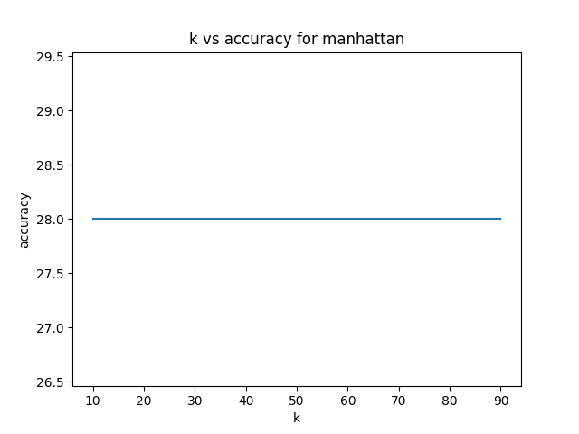
2. 
    Euclidean
    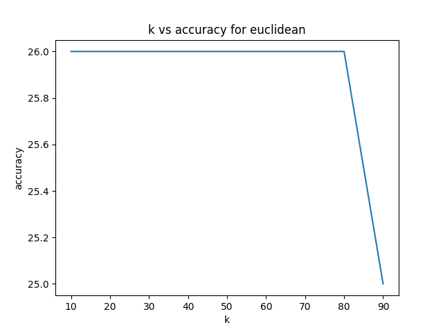
3. 
    Cosine
    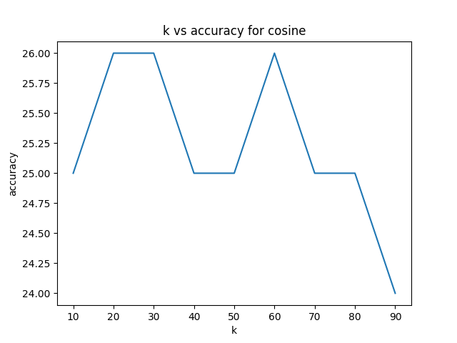

As we can see from the plot that the best accuracy for each of the distance metric is at k = 20 to k = 40. The accuracy is highest for manhattan distance metric.

Since from the histogram I have seen that the key and mode are not contributing much to the prediction, I have removed them from the features from starting.

Before removing them I was getting the best accuracy around 21-22% but after removing them I am getting the best accuracy around 28-31%.
There were multiple genres for same song, hence I have taken the first genre as the genre of the song. For this I have drop duplicates for the song name and taken the first genre.

There are some more features which are not contributing much to the prediction like time_signature. I can remove them to get better accuracy. But for now I have only removed key and mode.

### Optimaization


#### Part 1
I was trying to vectorize my code from starting only, hence I don't have any initial model. I have my best knn model for the best hyperparameters (k = 10, distance_metric = 'manhattan'). But this model is not as fast as for distance_metric = 'cosine'. Hence I am taking cosine distance metric model as my optimized model.

#### Part 2

The plot inference time for my model for different distance metrics and the sklearn model is following.
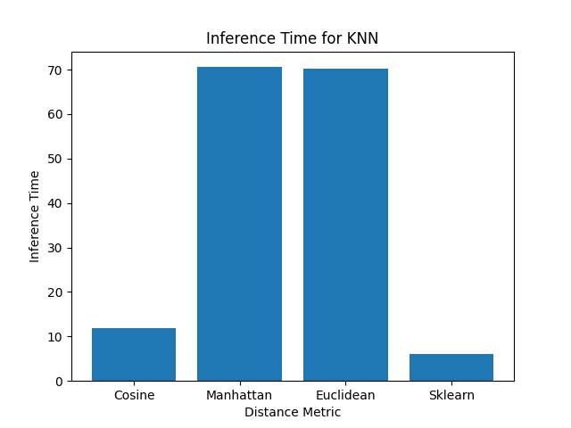

As we can clearly see from the plot that the cosine distance metric is the fastest among all the distance metrics for my model. The sklearn model is also faster than my model for all the distance metrics.

#### Part 3

The plot for inference time vs training size for my best model, my optimized model and the sklearn model is following.
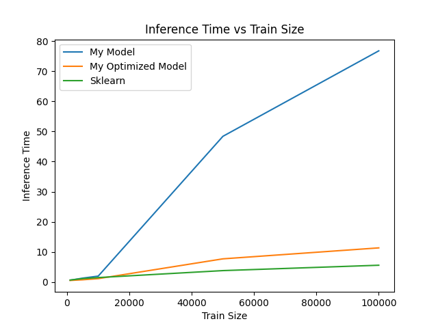

Here we can see that the inference time for all the three models is similar for smaller train sizes. But as the train size increases the inference time for my model increases more than the sklearn model. 
My optimized model is faster than my best model for all the train sizes.
My optimized model is faster than the sklearn model for smaller train sizes but as the train size increases the sklearn model is faster than my optimized model.


### Second Dataset
For the second dataset that given that was already suffled and splitted in (80:10:10) ratio for training, validating and testing. 
I used the best hyperparameters from the first dataset to train the model on the second dataset. The best hyperparameters were k = 10 and distance_metric = 'manhattan'.

```
Accuracy for validation data of Second Data set for best k: 10 and distance metric: manhattan is 23.857181498512308%

Scores
Accuracy: 0.23857181498512306
Micro Precision: 0.23857181498512306
Macro Precision: 0.23309489912840395
Micro Recall: 0.23857181498512306
Macro Recall: 0.2368804668354507
Micro F1 Score: 0.23857181498512306
Macro F1 Score: 0.22697882316775742
```

The accuracy that I got for the second dataset was lesser than the first dataset. The accuracy that I got for the second dataset was around 25%. This is because as this dataset was already splitted hence dropping duplicates doesn't removed much duplicated from the data and hence there are multiple genres for same song. This is the reason that the accuracy is lesser for the second dataset.

Another reason for the lesser accuracy is that I hypertuned the model for some other dataset and used the same hyperparameters for this dataset. The best hyperparameters for this dataset can be different than the first dataset.

## Linear Regression

Linear Regression Class that I have Implemented is following.

```python
import numpy as np
import matplotlib.pyplot as plt

class LinearRegression:
    def __init__(self, n_Epochs=1000000, learning_rate=0.001, k=1, error_threshold=1e-6, lambda_=0.01, regularization=None):
        self.n_Epochs = n_Epochs
        self.learning_rate = learning_rate
        self.k = k
        self.mse_list = []
        self.variance_list = []
        self.std_list = []
        self.epoch_to_converge = n_Epochs
        self.error_threshold = error_threshold
        self.lambda_ = lambda_  
        self.regularization = regularization

    def fit(self, x_train, y_train, create_gif=False):
        self.y_train = y_train
        self.y_train = self.y_train[np.argsort(x_train)]
        x_train = np.sort(x_train)
        self.x_train = x_train.reshape(-1, 1)
        if create_gif:
            self.x_train_gif = self.x_train.copy()

        x_train = x_train.reshape(-1, 1)
        for i in range(2, self.k + 1):
            temp = x_train ** i
            self.x_train = np.hstack((self.x_train, temp))

        self.n_samples = x_train.shape[0]
        self.n_features = self.k
        self.weights = np.zeros(self.n_features)
        self.bias = 0
        for i in range(self.n_Epochs):
            self.update_weights()

            if i > 2:
                if abs(self.mse_list[i - 1] - self.mse_list[i - 2]) < self.error_threshold:
                    self.epoch_to_converge = i
                    break

            if create_gif and i % 100 == 0:
                self.save_image(f'./figures/gif_images/{i // 100}.png')

    def update_weights(self):
        y_pred = self.predict(self.x_train)
        mse = np.mean((self.y_train - y_pred) ** 2)
        std = np.std(y_pred)
        variance = np.var(y_pred)
        self.mse_list.append(mse)
        self.variance_list.append(variance)
        self.std_list.append(std)

        dW = (1 / self.n_samples) * np.dot(self.x_train.T, (y_pred - self.y_train))
        db = (1 / self.n_samples) * np.sum(y_pred - self.y_train)

        if self.regularization == 'l1':
            reg_term = self.lambda_ * np.sign(self.weights)
            self.weights -= self.learning_rate * (dW + reg_term)
        elif self.regularization == 'l2':
            reg_term = self.lambda_ * self.weights
            self.weights -= self.learning_rate * (dW + reg_term)
        else:
            self.weights -= self.learning_rate * dW

        self.bias -= self.learning_rate * db

    def predict(self, x):
        if x.ndim == 1:
            x = x.reshape(-1, 1)
            xc = x.copy()
            for i in range(2, self.k + 1):
                temp = x ** i
                xc = np.hstack((xc, temp))
            x = xc
        return np.dot(x, self.weights) + self.bias

    def get_line(self, x):
        w = self.weights
        b = self.bias
        n = len(w)
        y = b
        for i in range(n):
            y += w[i] * x ** (i + 1)
        return y

    def save_image(self, name):
        y = self.y_train
        x = self.x_train_gif
        fig, axs = plt.subplots(2, 2, figsize=(10, 10))
        axs[0, 0].scatter(x, y)
        axs[0, 0].plot(x, self.get_line(x), color='red')
        axs[0, 0].set_xlabel('X')
        axs[0, 0].set_ylabel('Y')
        axs[0, 0].set_title('Regression line')
        axs[0, 1].plot(self.mse_list)
        axs[0, 1].set_xlabel('Epochs')
        axs[0, 1].set_ylabel('MSE')
        axs[0, 1].set_title('Epochs vs MSE')
        axs[1, 0].plot(self.variance_list)
        axs[1, 0].set_xlabel('Epochs')
        axs[1, 0].set_ylabel('Variance')
        axs[1, 0].set_title('Epochs vs Variance')
        axs[1, 1].plot(self.std_list)
        axs[1, 1].set_xlabel('Epochs')
        axs[1, 1].set_ylabel('Standard Deviation')
        axs[1, 1].set_title('Epochs vs Standard Deviation')
        plt.savefig(name)
        plt.close()

```

Here I am using different type of parameters for initialization of the model, that are following.
1. n_Epochs: Number of epochs for which the model will run if the best fit line doesn't converged.
2. learning_rate: The learning rate for the model. I am also tuning that learning model.
3. k: The degree of the polynomial regression.
4. error_threshold: The error threshold for which the model will stop if the error is less than this threshold.
5. lambda_: The regularization parameter for the model.
6. regularization: The type of regularization that is used for the model. It can be 'L1', 'L2' or None.

In the fit method I am fitting the model on the training data. I am also saving the mse, variance and standard deviation for each epoch. 

There is also a parameter create_gif, if it is True then the model will save the images for each 100 epochs in the figures/gif_images folder. Using those images I can create a gif for the training of the model.

There is get_line method that is used to get the line for the regression for the given x.

This model is stored in at path `models/linear_regression/linear_regression.py`.

To calculate the mse, variance and standard deviation, I am using a which is as follows.
```python
import numpy as np

class Scores:
    def __init__(self, y_test, y_pred):
        self.y_test = y_test
        self.y_pred = y_pred
        self.mse = np.mean((y_pred - y_test) ** 2)
        self.std = np.std(y_pred)
        self.variance = np.var(y_pred)
```

This model is stored in at path `performance_measures/regression_score.py`.

First I have suffled the dataset and splitted it in (80:10:10) ratio for training, validating and testing.

### Degree 1

Regression line for degree 1 is following.
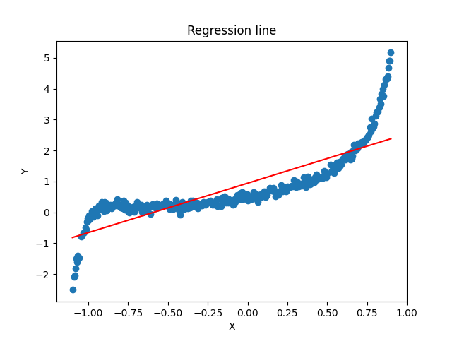

The mse, variance and standard deviation for degree 1 is following.
1. Training Data
```
Train Metrics for Degree 1
MSE: 0.3501051358792583
STD: 0.8927631707598346
Variance: 0.7970260790651535
```
2. Validation Data
``` 
Test Metrics for Degree 1
MSE: 0.20523945956931736
STD: 0.8632122691377636
Variance: 0.7451354215899668
```

### Degree k

Regession line for degree k = 20 is following.
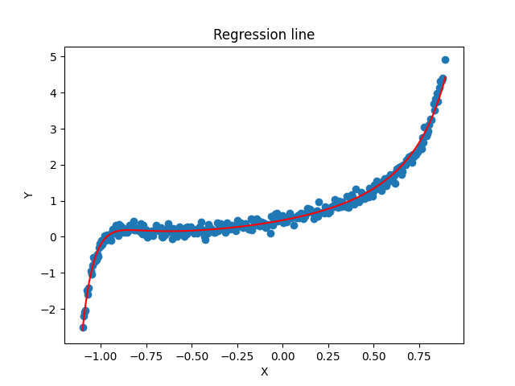

For tuning I am using the validation set. 
Following is the graph of k vs MSE.
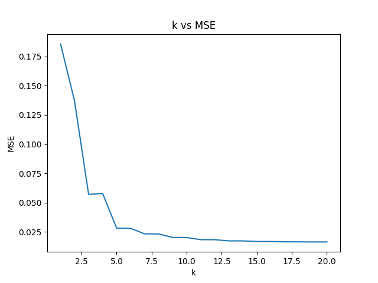
Here we can see that the mse for k = 10 to 20 is almost same.

K vs MSE, Variance and Standard for both Train and Test Split.
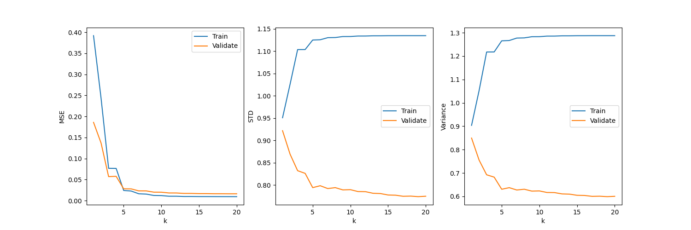

K that minimizes the MSE is 10 in my case but this also depends on the suffling of the data. 
```
Best k: 10
Minimum MSE: 0.009313003
```

For tuning the learning rate I am using 4 values of learning rate (0.1, 0.01, 0.001, 0.0001) and the best k that I got from the previous step.

As the learning rate decreases the model takes more epochs to converge. The best learning rate that I got is 0.01. Which is optimal for mse as well as the number of epochs to converge.

The graph for learning rate vs MSE, Epoch to converge is following.
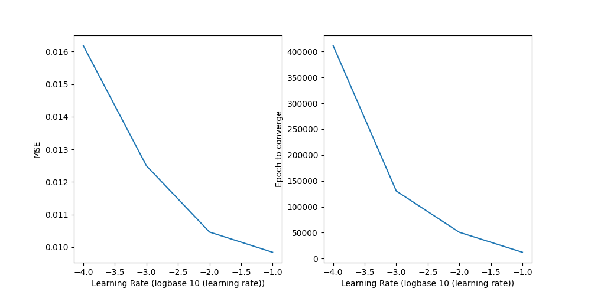

```
Best learning rate: 0.01
Minimum MSE: 0.011544186
```

On testing the model with the best hyperparameters I got the following metrics.
```
Test Metrics with best hyperparameters
MSE: 0.026688813
Std: 1.285316266
Variance: 1.652037903
```
### Animation

The gif for the training of the model for 5 different values of k is following.

1. k = 1
[view](./figures/gif_1.gif)


2. k = 5
[view](./figures/gif_5.gif)
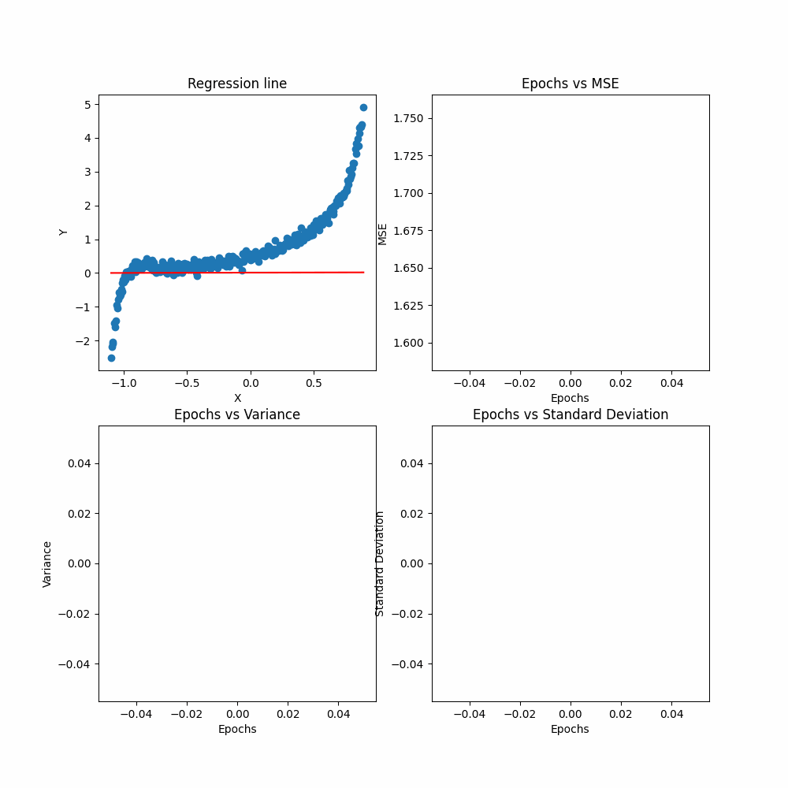

3. k = 10
[view](./figures/gif_10.gif)


4. k = 15
[view](./figures/gif_15.gif)
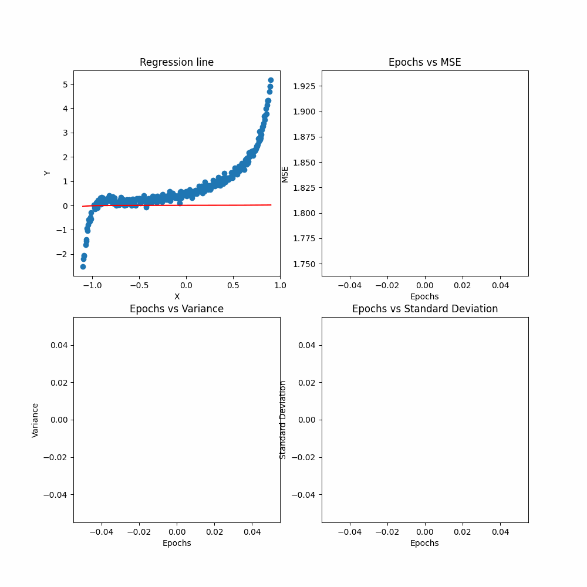

5. k = 20
[view](./figures/gif_20.gif)
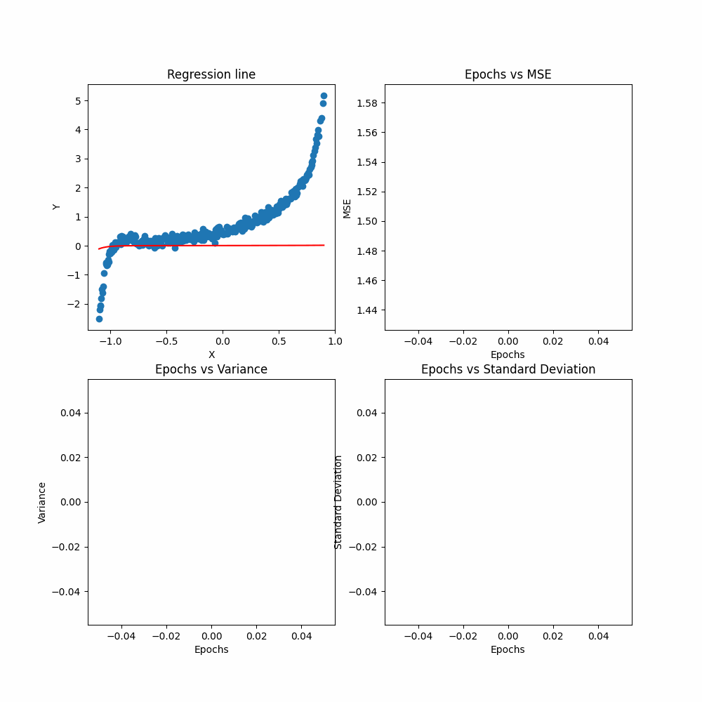


Random Initialization of the weights and bias for the model will lead to same results for the model. The only difference will be the number of epochs to converge. The final mse, variance and standard deviation will be same for all the random initializations.


### Regularization

The regression line for No Regularization with k = 5 ans its metrics are following.


```
Train Metrics
k=5, No Regularization
MSE: 0.01097159561582553
STD: 0.4688540348275144
Variance: 0.21982410597404012

Test Metrics
k=5, No Regularization
MSE: 0.022202022174420768
STD: 0.3456165310590047
Variance: 0.11945078654125997
```

The regression line for k = 20 ans no regularization ans its metrics are following.
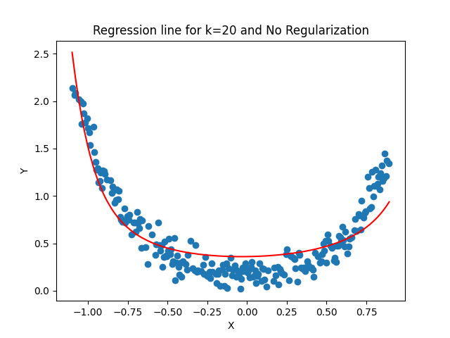

```
Train Metrics
k=20, No Regularization
MSE: 0.01012555880429296
STD: 0.47118411258353277
Variance: 0.22201446795113128

Test Metrics
k=20, No Regularization
MSE: 0.021472082174669425
STD: 0.341292437416864
Variance: 0.11648052783794403
```
The regression line for L1 Regularization with k = 20 ans its metrics are following.
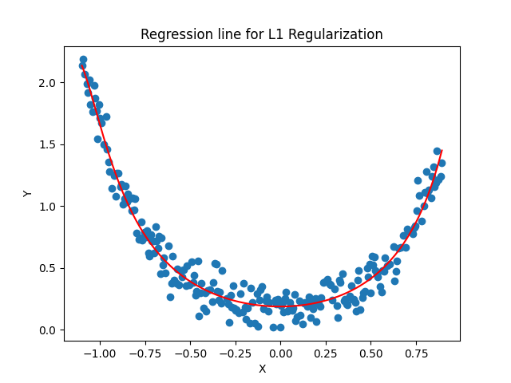

```
Train Metrics
k=20, L1 Regularization
MSE: 0.015707628873725118
STD: 0.43299028395810857
Variance: 0.1874805860021235

Test Metrics
k=20, L1 Regularization
MSE: 0.030565101566008303
STD: 0.2950431408839279
Variance: 0.08705045498265332
```

The regression line for L2 Regularization with k = 20 ans its metrics are following.
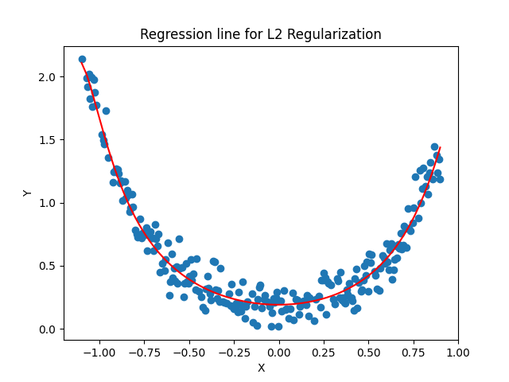
```
Train Metrics
k=20, L2 Regularization
MSE: 0.011001926944055522
STD: 0.46028024799156636
Variance: 0.21185790669117782

Test Metrics
k=20, L2 Regularization
MSE: 0.023498125044350466
STD: 0.32754325549029223
Variance: 0.10728458421717883
```


From the given dataset, I am not seeing the ovefitting for any value fo k. Hence the regularization is not helping much in this case. The mse is almost same for all the regularization types.

# References
### For plotting, labelling, other syntactical references I have taken help from the internet resources ans Copilot.

### The code to create the gif was also taken from the internet resources. 