# Assignment 2

## K-means clustering

### Task 1: K-means class
```python
class KMeans:
    def __init__(self, k = 5, n_iter = 100):
        self.k = k
        self.n_iter = n_iter
        self.prev_cost = 1e9

    def fit(self, X):
        self.X = X
        shp = self.X.shape
        self.n_samples = shp[0]
        self.n_features = shp[1]
        self.centroids = self.X[np.random.choice(self.n_samples, self.k, replace = False)]
        self.labels = np.zeros(self.n_samples)
        for _ in range(self.n_iter):
            self.labels = self.predict(self.X)
            for i in range(self.k):
                self.centroids[i] = np.mean(self.X[self.labels == i], axis = 0)
            self.cost = self.getCost()

            if (self.prev_cost - self.cost) < 1e-4:
                break
            self.prev_cost = self.cost


    def predict(self, X):
        labels = np.zeros(self.n_samples)
        for i in range(self.n_samples):
            dist = np.linalg.norm(X[i] - self.centroids, axis = 1)
            labels[i] = np.argmin(dist)
        return labels

    def getCost(self):
        cost = 0
        for i in range(self.n_samples):
            cost += np.square(np.linalg.norm(self.X[i] - self.centroids[int(self.labels[i])]))
        return cost
```

- Clustering Plot for the smaller dataset<br>
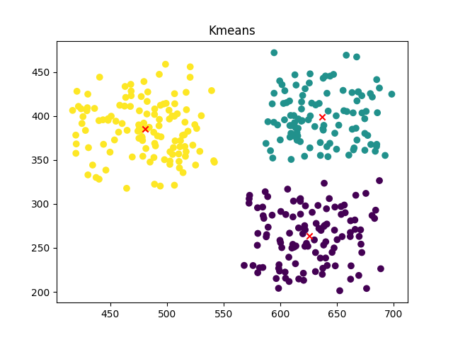

### Task 2: Elbow Method

- Elbow method for the smaller dataset<br>
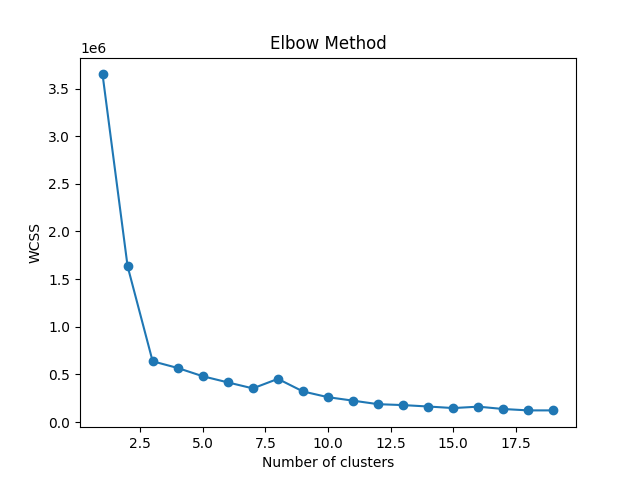

Here from plot we can see that the elbow point is at k = 3.

- Elbow method for the larger dataset<br>
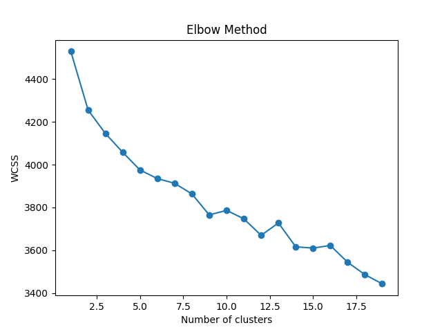

It depends on the different runs, as in the class I am initializing the centroids randomly. For this plot the elbow point is at k = 11.

Hence ```k_kmeans1 = 11```

On performing the K-means clustering on the larger dataset with k = 11, the Within-Cluster Sum of Squares (WCSS) cost is 3723.25035998532.

But this cost also varies for different runs, as the centroids are initialized randomly.

## Gaussian Mixture Model

### Task 1: GMM class
```python
class Gmm:
    def __init__(self, k=3, n_iter=100):
        self.k = k
        self.n_iter = n_iter
        self.prev_likelihood = 0

    def fit(self, X):
        self.X = X
        self.n_samples, self.n_features = X.shape
        self.pi = np.ones(self.k) / self.k
        self.mu = X[np.random.choice(self.n_samples, self.k, replace=False)]
        self.sigma = np.array([np.eye(self.n_features)] * self.k)

        for _ in range(self.n_iter):
            self.e_step()
            self.m_step()
            likelihood = self.getLikelihood()
            if abs(likelihood - self.prev_likelihood) < 1e-6:
                break
            self.prev_likelihood = likelihood

    def e_step(self):
        self.gamma = np.zeros((self.n_samples, self.k))
        log_probs = np.zeros((self.n_samples, self.k))
        
        for j in range(self.k):
            mvn = multivariate_normal(mean=self.mu[j], cov=self.sigma[j])
            log_probs[:, j] = np.log(self.pi[j]) + mvn.logpdf(self.X)
        
        log_probs_max = np.max(log_probs, axis=1, keepdims=True)
        log_probs -= log_probs_max 
        probs = np.exp(log_probs)
        self.gamma = probs / np.sum(probs, axis=1, keepdims=True)

    def m_step(self):
        N = np.sum(self.gamma, axis=0)
        N = np.where(N < 1e-6, 1e-6, N)
        self.pi = N / self.n_samples
        self.mu = np.dot(self.gamma.T, self.X) / N[:, None]
        
        for j in range(self.k):
            x_mu = self.X - self.mu[j]
            weighted_cov = np.dot(self.gamma[:, j] * x_mu.T, x_mu) / N[j]
            self.sigma[j] = weighted_cov + np.eye(self.n_features) * 1e-6

    def get_params(self):
        return self.pi, self.mu, self.sigma
    
    def getMembership(self):
        return self.gamma
    
    def getLikelihood(self):
        log_likelihood = 0
        log_probs = np.zeros((self.n_samples, self.k))
        
        for j in range(self.k):
            mvn = multivariate_normal(mean=self.mu[j], cov=self.sigma[j])
            log_probs[:, j] = np.log(self.pi[j]) + mvn.logpdf(self.X)
        
        log_probs_max = np.max(log_probs, axis=1, keepdims=True)
        log_probs -= log_probs_max
        probs = np.exp(log_probs)
        log_likelihood = np.sum(log_probs_max.squeeze() + np.log(np.sum(probs, axis=1)))
        
        return log_likelihood

    def get_num_params(self):
        num_means = self.k * self.n_features
        num_covariances = self.k * (self.n_features * (self.n_features + 1)) // 2 
        num_weights = self.k - 1
        return num_means + num_covariances + num_weights

    def aic(self):
        num_params = self.get_num_params()
        log_likelihood = self.getLikelihood()
        return 2 * num_params - 2 * log_likelihood
    
    def bic(self):
        num_params = self.get_num_params()
        log_likelihood = self.getLikelihood()
        return num_params * np.log(self.n_samples) - 2 * log_likelihood
```

Here Initially I implemented the GMM class with the formula given in class because of the overflow I took help from LLM to implement the log probabilities. 

So the Current version of the E-step and the M-step is taken from the LLM.

### Task 2: Testing, AIC and BIC

The class works but not perfectly for the given dataset as there is problem of overflow and singular matrices.

The sklearn class also works. The results are similar to my class. Because the problem of overflow and singular matrices is handled in the inbuilt class.

```
Likelihood:  522241.37061497767
pi:  [0.245 0.375 0.38 ]
Inbuilt GMM Likelihood:  575859.1572580193
```
As we can see from the above results, the likelihood of my gmm is less than the inbuilt gmm (Although they are close). This is because we initialize the mu and sigma randomly and the likelihood depends on the initialization of the mu and sigma. The above results are for the best k that is 3.

- Plot for the smaller dataset.<br>
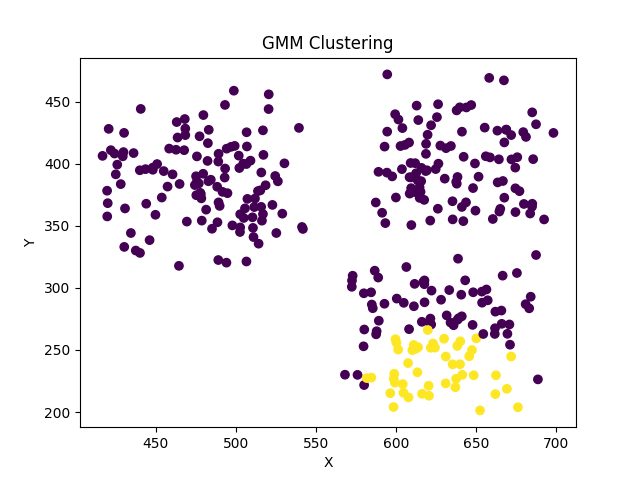

- AIC and BIC for the larger dataset<br>


- AIC and BIC for the larger dataset using inbuilt function<br>
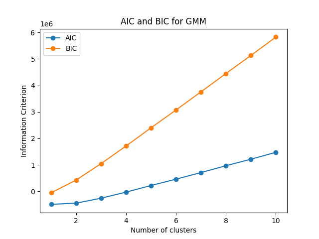

From the above plots, Elbow point is not very clear for this dataset. But most closer to the elbow point is at k = 2 of k = 3.

Hence ```k_gmm1 = 3```


## Dimensionality Reduction and Visualization

### Task 1: PCA class
```python
class PCA:
    def __init__(self, n_components):
        self.n_components = n_components

    def fit(self, X):
        self.X = X
        shape = X.shape
        self.n_samples = shape[0]
        self.means = np.mean(X, axis=0)
        X = X - self.means
        self.cov = np.dot(X.T, X) / self.n_samples
        self.eig_values, self.eig_vectors = np.linalg.eig(self.cov)
        idxs = np.argsort(self.eig_values)[::-1]
        self.eig_values = self.eig_values[idxs]
        self.eig_vectors = self.eig_vectors[:, idxs]

    
    def transform(self, X):
        X = X - self.means
        return np.dot(X, self.eig_vectors[:, :self.n_components])

    def checkPCA(self, X, threshold=0.1):
        if (self.eig_vectors is None) or (self.eig_values is None):
            return False
        
        if (X.shape[1] != self.eig_vectors.shape[1]):
            return False
        
        if (self.n_components > self.eig_vectors.shape[1]):
            return False

        X = X - self.means

        X_reduced = np.dot(X, self.eig_vectors[:, :self.n_components])

        X_original = np.dot(X_reduced, self.eig_vectors[:, :self.n_components].T)

        error = np.mean(np.square(X - X_original))

        return error < threshold
    
    def getExplainedVariance(self):
        sum1 = np.cumsum(self.eig_values[:self.n_components])
        sum2 = np.sum(self.eig_values)
        return sum1 / sum2
```

###  Perform Dimensionality Reduction

- keeping the `error_threshold = 0.1` for both 2D and 3D checkPCA returns True.
```
Before Transformation: True
(200, 512)
After PCA
(200, 2)
Before Transformation: True
(200, 512)
After PCA
(200, 3)
``` 

- Plot for 2D<br>


- Plot for 3D<br>
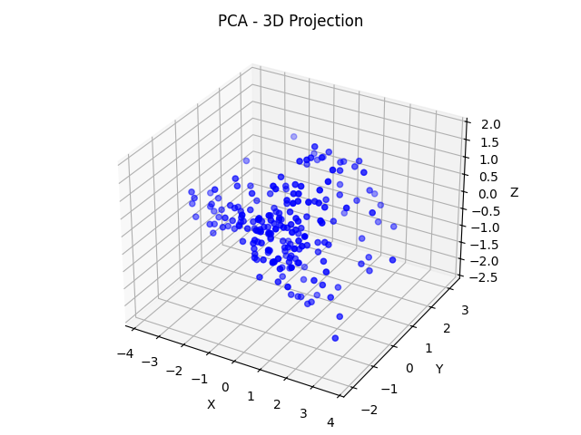

### Data Analysis

- The new axes represent the directions of maximum variance in the data.

- When we look at the 2D plot, then we can identify 2 or 3 clusters. But when we look at the 3D plot, then we can identify 4 clusters. Hence taking `k2 = 4`.


## PCA + Clustering
### K-means Clustering Based on 2D Visualization
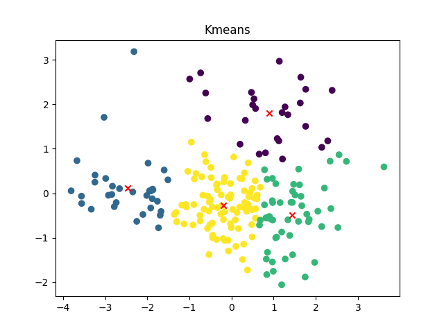<br>

- K-means clustering on the 2D PCA transformed data with k = k2.
- The cost(WCSS) for k = k2 for dataset is following.
```
Cost of Kmeans for k2: 4055.3350336015887
```

### PCA + K-Means Clustering
- Scree Plot <br>


- Eigen Values Plot <br>
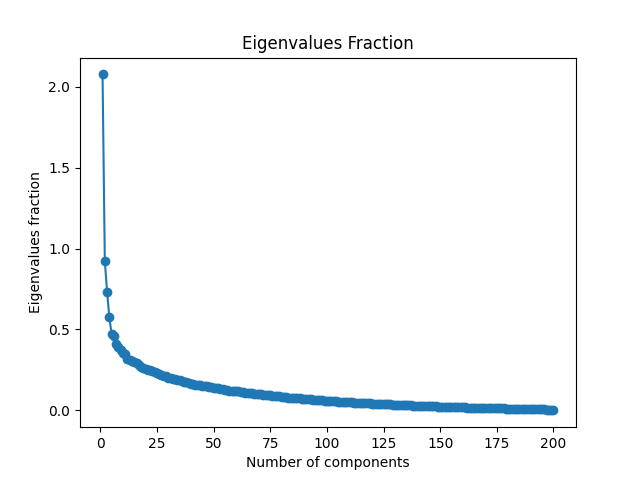

To capture 95% of the variance, we need 132 dimensions.

- Elbow Method <br>
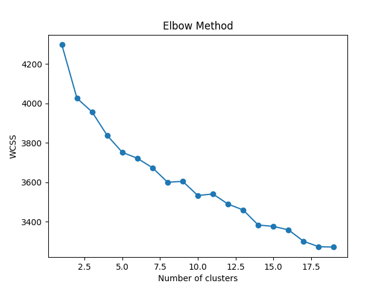

From the above plot, the elbow point is at k = 8.
Hence `k_kmeans3 = 8`.

- The cost(WCSS) for k = k_kmeans3 for reduced Dataset: 3633.909127962344

### GMM Clustering Based on 2D Visualization

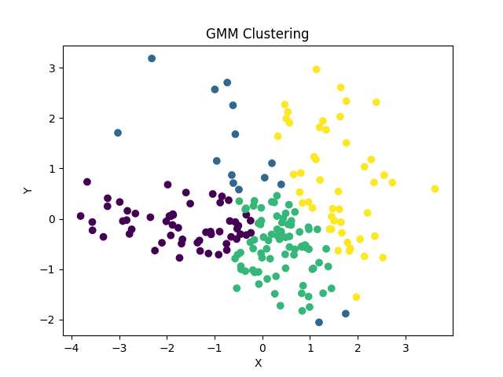

- GMM clustering on the 2D PCA transformed data with k = k2.
- The Likelihood for k = k2 for dataset is following.
```
Likelihood for original Dataset with k = k2:  542268.2594889485
```


###  PCA + GMMs

- AIC and BIC for the reduced dataset <br>
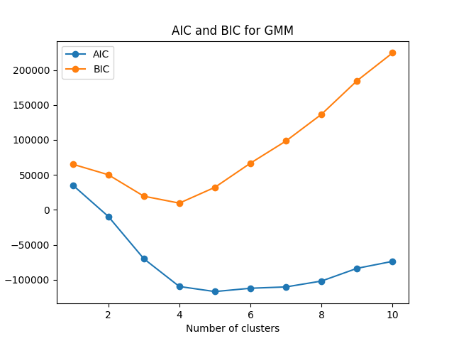

From the above plots, the elbow point is at k = 4. It vary for different runs but most of the time it is at k = 4 of k = 5.
Hence `k_gmm3 = 4`.

- With k = k_gmm3, the Likelihood for reduced Dataset:  89705.35369496288.

## Cluster Analysis

###  K- Means Cluster Analysis

- The clusters for k = k_means1 = 11
```
Cluster 1: ['helicopter', 'gym', 'rifle', 'van', 'microphone', 'laptop', 'calendar', 'calculator', 'envelope', 'ambulance', 'television', 'camera', 'car', 'telephone', 'bicycle', 'keyboard', 'radio', 'truck']

Cluster 2: ['deer', 'panda', 'ape', 'cat', 'bear', 'giraffe', 'monkey', 'cow', 'pencil', 'sweater', 'sun', 'mouse', 'ant', 'goldfish', 'bee', 'beetle', 'tomato', 'lantern', 'elephant', 'pant', 'potato']

Cluster 3: ['mug', 'microwave', 'bench', 'bucket', 'chair', 'candle', 'oven', 'dustbin', 'throne', 'loudspeaker', 'stove', 'toaster', 'suitcase']

Cluster 4: ['shark', 'lizard', 'frog', 'starfish', 'peacock', 'snake', 'dragonfly', 'crocodile']

Cluster 5: ['climb', 'stairs', 'basket', 'ladder', 'skate', 'length', 'basketball', 'walk']

Cluster 6: ['listen', 'flame', 'knock', 'bury', 'download', 'postcard', 'hard', 'fight', 'call', 'hit', 'far', 'cry', 'sleep', 'clean', 'slide', 'draw', 'pray', 'arrest', 'email', 'buy', 'burn', 'fire', 'close', 'lazy', 'hang', 'book', 'enter', 'happy', 'loud', 'love', 'cook', 'recycle', 'cut']

Cluster 7: ['eraser', 'carrot', 'grass', 'forest', 'brush', 'feather', 'passport', 'plant', 'notebook', 'knit', 'baseball', 'pear', 'saturn', 'fruit', 'grape', 'badminton', 'pillow', 'tree', 'toothbrush', 'parachute', 'toothpaste', 'comb', 'paintbrush']

Cluster 8: ['drive', 'sing', 'rose', 'dive', 'sit', 'exit', 'brick', 'fishing', 'spider', 'bullet', 'eat', 'puppet', 'fly', 'lake', 'face', 'kiss', 'selfie', 'catch', 'paint', 'dig', 'run', 'clap', 'pull', 'cigarette', 'puppy', 'feet', 'empty', 'fish', 'drink', 'finger', 'bird', 'clock', 'spiderman', 'hammer', 'tattoo', 'earth', 'fingerprints', 'rain', 'tank', 'airplane', 'pizza', 'key', 'swim', 'zip', 'butterfly', 'rainy', 'wheel', 'shoe', 'sunny']

Cluster 9: ['smile', 'scream', 'hollow', 'sad', 'angry', 'scary']

Cluster 10: ['table', 'roof', 'bed', 'jacket', 'boat', 'door', 'igloo', 'tent']

Cluster 11: ['needle', 'spoon', 'bend', 'kneel', 'flute', 'scissor', 'screwdriver', 'teaspoon', 'sword', 'knife', 'windmill', 'arrow', 'fork']
```

- The clusters for k = k2 = 4
```
Cluster 1: ['drive', 'rose', 'dive', 'fishing', 'shark', 'grass', 'forest', 'lake', 'climb', 'kiss', 'roof', 'stairs', 'plant', 'baseball', 'bucket', 'feet', 'boat', 'basket', 'fish', 'door', 'badminton', 'ladder', 'bird', 'clock', 'tree', 'skate', 'dustbin', 'rain', 'airplane', 'pizza', 'swim', 'sword', 'rainy', 'basketball', 'wheel', 'bicycle', 'windmill', 'arrow', 'shoe', 'walk', 'truck']        

Cluster 2: ['needle', 'eraser', 'table', 'carrot', 'brush', 'mug', 'feather', 'spoon', 'puppet', 'gym', 'passport', 'rifle', 'pencil', 'bed', 'microwave', 'notebook', 'knit', 'sweater', 'cigarette', 'microphone', 'jacket', 'bench', 'flute', 'scissor', 'laptop', 'calendar', 'chair', 'finger', 'candle', 'igloo', 'oven', 'calculator', 'pillow', 'envelope', 'hammer', 'toothbrush', 'screwdriver', 'fingerprints', 'teaspoon', 'length', 'ambulance', 'television', 'throne', 'tent', 'camera', 'car', 'loudspeaker', 'telephone', 'stove', 'knife', 'toothpaste', 'toaster', 'comb', 'keyboard', 'fork', 'radio', 'suitcase', 'paintbrush']

Cluster 3: ['deer', 'panda', 'ape', 'helicopter', 'cat', 'bear', 'spider', 'giraffe', 'lizard', 'frog', 'monkey', 'cow', 'starfish', 'van', 'sun', 'pear', 'peacock', 'saturn', 'fruit', 'grape', 'mouse', 'ant', 'goldfish', 'spiderman', 'bee', 'beetle', 'snake', 'tomato', 'dragonfly', 'parachute', 'butterfly', 'lantern', 'elephant', 'pant', 'potato', 'crocodile']

Cluster 4: ['sing', 'listen', 'flame', 'sit', 'knock', 'exit', 'brick', 'smile', 'bullet', 'bury', 'download', 'eat', 'postcard', 'hard', 'bend', 'fight', 'call', 'fly', 'face', 'kneel', 'scream', 'selfie', 'catch', 'hit', 'paint', 'far', 'dig', 'cry', 'run', 'clap', 'pull', 'sleep', 'hollow', 'puppy', 'clean', 'sad', 'empty', 'slide', 'drink', 'draw', 'pray', 'arrest', 'email', 'buy', 'burn', 'fire', 'close', 'angry', 'lazy', 'scary', 'hang', 'book', 'tattoo', 'earth', 'tank', 'enter', 'key', 'zip', 'happy', 'loud', 'love', 'cook', 'recycle', 'cut', 'sunny']
```

- The clusters for k = k_kmeans3 = 8
```
Cluster 1: ['listen', 'flame', 'knock', 'bury', 'download', 'postcard', 'hard', 'fight', 'call', 'hit', 'paint', 'far', 'cry', 'clap', 'sleep', 'clean', 'sad', 'slide', 'draw', 'pray', 'arrest', 'email', 'buy', 'burn', 'fire', 'close', 'angry', 'lazy', 'scary', 'hang', 'book', 'enter', 'happy', 'loud', 'love', 'cook', 'recycle', 'cut']

Cluster 2: ['deer', 'carrot', 'spider', 'shark', 'lizard', 'frog', 'scream', 'ant', 'spiderman', 'beetle', 'snake', 'pizza', 'butterfly', 'arrow']

Cluster 3: ['drive', 'sing', 'rose', 'dive', 'exit', 'brick', 'fishing', 'smile', 'bear', 'bullet', 'grass', 'bend', 'puppet', 'fly', 'face', 'climb', 'kneel', 'monkey', 'kiss', 'passport', 'selfie', 'catch', 'plant', 'microwave', 'notebook', 'pull', 'baseball', 'hollow', 'bucket', 'puppy', 'boat', 'basket', 'empty', 'fish', 'drink', 'door', 'mouse', 'finger', 'candle', 'bird', 'clock', 'oven', 'tree', 'envelope', 'skate', 'hammer', 'tattoo', 'earth', 'fingerprints', 'dustbin', 'tank', 'airplane', 'key', 'zip', 'loudspeaker', 'telephone', 'stove', 'basketball', 'wheel', 'bicycle', 'toaster', 'shoe', 'walk', 'keyboard', 'sunny', 'radio', 'truck']

Cluster 4: ['panda', 'ape', 'cat', 'eraser', 'mug', 'eat', 'gym', 'roof', 'rifle', 'cow', 'pencil', 'bed', 'dig', 'run', 'van', 'microphone', 'sun', 'feet', 'fruit', 'grape', 'laptop', 'calendar', 'calculator', 'bee', 'ambulance', 'television', 'tent', 'camera', 'tomato', 'car', 'pant', 'potato']

Cluster 5: ['forest', 'lake', 'rain', 'swim', 'rainy']

Cluster 6: ['sit', 'table', 'stairs', 'sweater', 'jacket', 'bench', 'chair', 'ladder', 'pillow', 'throne', 'suitcase']

Cluster 7: ['brush', 'feather', 'spoon', 'knit', 'cigarette', 'flute', 'scissor', 'badminton', 'toothbrush', 'screwdriver', 'teaspoon', 'length', 'sword', 'knife', 'toothpaste', 'comb', 'fork', 'paintbrush']

Cluster 8: ['helicopter', 'needle', 'giraffe', 'starfish', 'pear', 'peacock', 'saturn', 'igloo', 'goldfish', 'dragonfly', 'parachute', 'lantern', 'elephant', 'windmill', 'crocodile']
```

The cost(WCSS) for k = k_kmeans1 = 11, k = k2 = 4 and k = k_kmeans3 = 8 for the original dataset is as follows:
```
Cost of Kmeans for k_kmeans1: 3723.25035998532
Cost of Kmeans for k2: 4055.3350336015887
Cost of Kmeans for k_kmeans3: 3633.909127962344
```
Here we can see that least cost is for k = k_kmeans3 = 8. And also the most of the clusters are meaningful in this case.

Hence, `k_kmeans = 8`.

### GMM Cluster Analysis

- The clusters for k = k_gmm1 = 3
```
Cluster 1: ['drive', 'deer', 'dive', 'eraser', 'table', 'exit', 'fishing', 'shark', 'giraffe', 'lizard', 'feather', 'frog', 'lake', 'climb', 'roof', 'stairs', 'starfish', 'microwave', 'notebook', 'cigarette', 'microphone', 'baseball', 'bench', 'feet', 'boat', 'pear', 'basket', 'saturn', 'slide', 'flute', 'grape', 'badminton', 'mouse', 'igloo', 'goldfish', 'spiderman', 'tree', 'beetle', 'skate', 'toothbrush', 'snake', 'tattoo', 'dustbin', 'airplane', 'pizza', 'swim', 'dragonfly', 'butterfly', 'sword', 'loudspeaker', 'telephone', 'elephant', 'stove', 'knife', 'toothpaste', 'basketball', 'bicycle', 'windmill', 'toaster', 'comb', 'shoe', 'walk', 'keyboard', 'truck', 'suitcase']

Cluster 2: ['sing', 'listen', 'rose', 'flame', 'knock', 'brick', 'smile', 'bear', 'bury', 'download', 'forest', 'postcard', 'hard', 'fight', 'call', 'fly', 'face', 'scream', 'monkey', 'kiss', 'passport', 'selfie', 'catch', 'hit', 'paint', 'plant', 'far', 'cry', 'clap', 'sleep', 'puppy', 'clean', 'sad', 'empty', 'fish', 'drink', 'draw', 'pray', 'arrest', 'email', 'buy', 'bird', 'clock', 'burn', 'fire', 'close', 'angry', 'lazy', 'scary', 'hang', 'book', 'earth', 'fingerprints', 'rain', 'tank', 'enter', 'key', 'happy', 'loud', 'love', 'rainy', 'cook', 'recycle', 'cut', 'sunny', 'radio']

Cluster 3: ['panda', 'ape', 'helicopter', 'sit', 'cat', 'needle', 'carrot', 'spider', 'bullet', 'grass', 'brush', 'mug', 'eat', 'spoon', 'bend', 'puppet', 'gym', 'kneel', 'rifle', 'cow', 'pencil', 'bed', 'dig', 'run', 'pull', 'knit', 'van', 'sweater', 'hollow', 'jacket', 'sun', 'bucket', 'peacock', 'fruit', 'scissor', 'laptop', 'door', 'calendar', 'chair', 'ladder', 'finger', 'candle', 'ant', 'oven', 'calculator', 'bee', 'pillow', 'envelope', 'hammer', 'screwdriver', 'teaspoon', 'length', 'ambulance', 'television', 'throne', 'tent', 'camera', 'zip', 'tomato', 'parachute', 'car', 'lantern', 'pant', 'wheel', 'arrow', 'potato', 'crocodile', 'fork', 'paintbrush']
```

- The clusters for k = k2 = 4
```
Cluster 1: ['drive', 'sing', 'listen', 'dive', 'flame', 'knock', 'exit', 'brick', 'bullet', 'bury', 'download', 'brush', 'eat', 'postcard', 'hard', 'bend', 'fight', 'puppet', 'call', 'fly', 'face', 'climb', 'kneel', 'scream', 'catch', 'hit', 'paint', 'far', 'cry', 'clap', 'baseball', 'hollow', 'puppy', 'clean', 'basket', 'sad', 'empty', 'drink', 'draw', 'pray', 'arrest', 'email', 'buy', 'burn', 'fire', 'close', 'angry', 'lazy', 'scary', 'hang', 'hammer', 'book', 'snake', 'tattoo', 'earth', 'fingerprints', 'length', 'rain', 'tank', 'enter', 'key', 'zip', 'sword', 'happy', 'loud', 'love', 'rainy', 'knife', 'cook', 'basketball', 'wheel', 'bicycle', 'arrow', 'recycle', 'cut', 'walk', 'sunny']

Cluster 2: ['panda', 'helicopter', 'carrot', 'fishing', 'spider', 'shark', 'giraffe', 'lizard', 'feather', 'frog', 'lake', 'starfish', 'notebook', 'knit', 'cigarette', 'bucket', 'fish', 'saturn', 'flute', 'badminton', 'candle', 'igloo', 'goldfish', 'bird', 'spiderman', 'toothbrush', 'dustbin', 'airplane', 'pizza', 'swim', 'tomato', 'dragonfly', 'parachute', 'butterfly', 'loudspeaker', 'lantern', 'elephant', 'toothpaste', 'windmill', 'toaster', 'crocodile', 'suitcase', 'paintbrush']

Cluster 3: ['deer', 'ape', 'needle', 'eraser', 'bear', 'grass', 'forest', 'spoon', 'monkey', 'passport', 'pencil', 'plant', 'microwave', 'jacket', 'pear', 'peacock', 'fruit', 'scissor', 'grape', 'door', 'mouse', 'finger', 'ant', 'oven', 'tree', 'beetle', 'skate', 'screwdriver', 'teaspoon', 'telephone', 'pant', 'potato', 'comb', 'fork']

Cluster 4: ['rose', 'sit', 'cat', 'table', 'smile', 'mug', 'gym', 'kiss', 'selfie', 'roof', 'stairs', 'rifle', 'cow', 'bed', 'dig', 'run', 'pull', 'sleep', 'van', 'sweater', 'microphone', 'bench', 'sun', 'feet', 'boat', 'slide', 'laptop', 'calendar', 'chair', 'ladder', 'clock', 'calculator', 'bee', 'pillow', 'envelope', 'ambulance', 'television', 'throne', 'tent', 'camera', 'car', 'stove', 'shoe', 'keyboard', 'radio', 'truck']
```

- The clusters for k = k_gmm3 = 4
```
Cluster 1: ['deer', 'panda', 'ape', 'rose', 'helicopter', 'bear', 'spider', 'shark', 'giraffe', 'lizard', 'hard', 'frog', 'fly', 'scream', 'monkey', 'starfish', 'clap', 'knit', 'van', 'sweater', 'baseball', 'hollow', 'sun', 'mouse', 'ant', 'spiderman', 'hang', 'beetle', 'skate', 'snake', 'airplane', 'pizza', 'tomato', 'dragonfly', 'parachute', 'butterfly', 'elephant', 'pant', 'basketball', 'arrow', 'crocodile']

Cluster 2: ['drive', 'sing', 'listen', 'dive', 'flame', 'sit', 'knock', 'table', 'exit', 'smile', 'grass', 'download', 'postcard', 'fight', 'call', 'gym', 'lake', 'face', 'climb', 'kiss', 'roof', 'stairs', 'rifle', 'catch', 'hit', 'bed', 'paint', 'far', 'microwave', 'cry', 'run', 'sleep', 'jacket', 'bench', 'clean', 'peacock', 'fish', 'slide', 'fruit', 'laptop', 'door', 'draw', 'calendar', 'pray', 'arrest', 'email', 'buy', 'bird', 'clock', 'oven', 'calculator', 'burn', 'pillow', 'fire', 'close', 'angry', 'lazy', 'scary', 'tree', 'envelope', 'book', 'tattoo', 'earth', 'ambulance', 'television', 'camera', 'car', 'happy', 'love', 'cook', 'wheel', 'windmill', 'cut', 'walk', 'keyboard', 'sunny', 'radio', 'truck']

Cluster 3: ['needle', 'eraser', 'carrot', 'fishing', 'brush', 'feather', 'eat', 'spoon', 'bend', 'puppet', 'passport', 'pencil', 'pull', 'cigarette', 'microphone', 'pear', 'empty', 'saturn', 'flute', 'scissor', 'badminton', 'finger', 'hammer', 'toothbrush', 'screwdriver', 'fingerprints', 'teaspoon', 'length', 'key', 'zip', 'sword', 'telephone', 'knife', 'toothpaste', 'toaster', 'comb', 'fork', 'paintbrush']

Cluster 4: ['cat', 'brick', 'bullet', 'bury', 'forest', 'mug', 'kneel', 'selfie', 'cow', 'plant', 'dig', 'notebook', 'bucket', 'puppy', 'feet', 'boat', 'basket', 'sad', 'drink', 'grape', 'chair', 'ladder', 'candle', 'igloo', 'goldfish', 'bee', 'dustbin', 'rain', 'tank', 'enter', 'throne', 'swim', 'tent', 'loudspeaker', 'lantern', 'loud', 'stove', 'rainy', 'bicycle', 'recycle', 'potato', 'shoe', 'suitcase']
```

The likelihood for k = k_gmm1 = 3, k = k2 = 4 and k = k_gmm3 = 4 for the original dataset is as follows:

```
Likelihood for original Dataset with k_gmm1:  522241.37061497767
Likelihood for original Dataset with k2:  542268.2594889485
Likelihood for original Dataset with k_gmm3:  89705.35369496288
```

For this I am not finding any meaningful clusters. But for less complexity we can take k = k_gmm3 = 4. As this is for the reduced dataset.

### Compare K-Means and GMMs

As Explained above with my analysis for this given dataset the k-means is giving better results as compared to the GMMs. As the clusters are more meaningful in the case of k-means as compared to the GMMs.

### Compare K-Means and GMMs

## Hierarchical Clustering

Plots For different linkage methods and different distance metrics

- Single Linkage with Euclidean Distance <br>
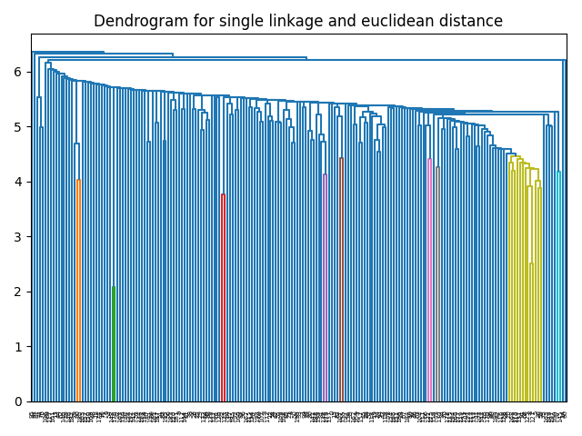

- Single Linkage with Cosine Distance <br>


- Complete Linkage with Euclidean Distance <br>
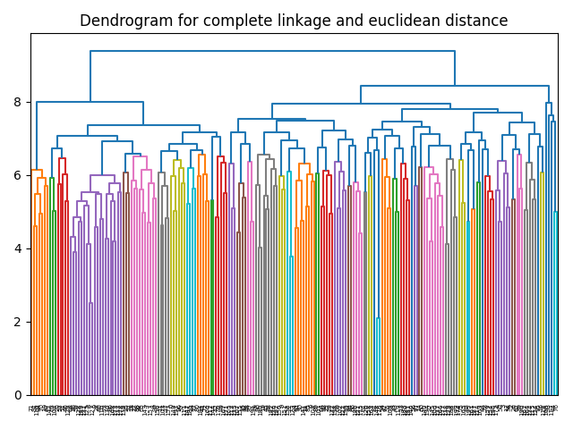

- Complete Linkage with Cosine Distance <br>
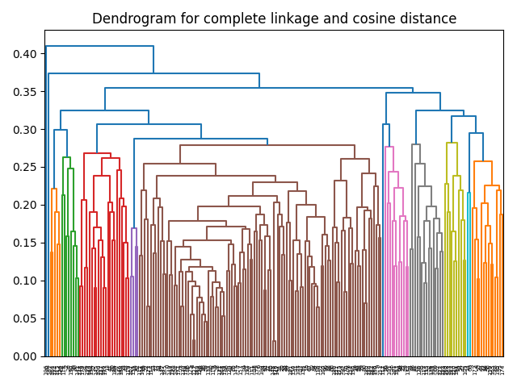

- Average Linkage with Euclidean Distance <br>
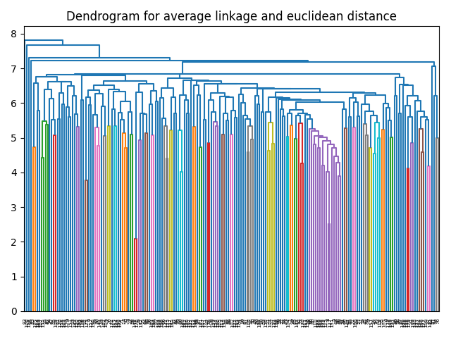

- Average Linkage with Cosine Distance <br>
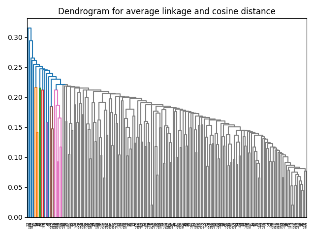

- Ward Linkage with Euclidean Distance <br>
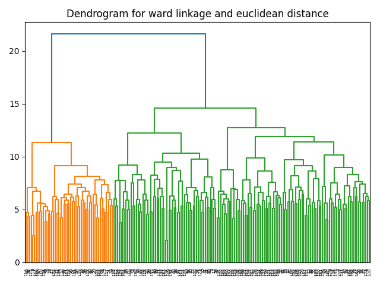

- Centroid Linkage with Euclidean Distance <br>
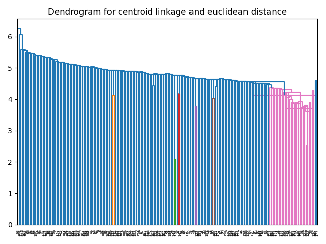


The best linkage method and distance metric is Ward Linkage with Euclidean Distance. The clusters in this case are clearly visible and meaningful.

```
Clusters for K-Means best k (k=8):
Cluster 1: ['listen', 'flame', 'download', 'hard', 'fight', 'hit', 'cry', 'sad', 'pray', 'buy', 'burn', 'fire', 'close', 'scary', 'cut']

Cluster 2: ['sing', 'dive', 'knock', 'exit', 'brick', 'smile', 'bury', 'bend', 'face', 'scream', 'kiss', 'selfie', 'catch', 'paint', 'far', 'sleep', 'hollow', 'clean', 'empty', 'slide', 'drink', 'door', 'draw', 'arrest', 'angry', 'lazy', 'hang', 'tattoo', 'earth', 'enter', 'key', 'swim', 'happy', 'loud', 'love', 'cook']

Cluster 3: ['deer', 'spider', 'shark', 'giraffe', 'lizard', 'feather', 'frog', 'fly', 'starfish', 'peacock', 'fish', 'ant', 'goldfish', 'bird', 'spiderman', 'bee', 'beetle', 'snake', 'dragonfly', 'butterfly', 'crocodile']

Cluster 4: ['panda', 'ape', 'sit', 'cat', 'eraser', 'carrot', 'bear', 'grass', 'forest', 'eat', 'puppet', 'gym', 'kneel', 'monkey', 'cow', 'pencil', 'plant', 'dig', 'run', 'clap', 'pull', 'sun', 'puppy', 'feet', 'pear', 'fruit', 'grape', 'finger', 'tree', 'fingerprints', 'rain', 'zip', 'tomato', 'elephant', 'pant', 'rainy', 'potato', 'shoe', 'sunny']

Cluster 5: ['brush', 'spoon', 'scissor', 'hammer', 'toothbrush', 'screwdriver', 'teaspoon', 'length', 'sword', 'knife', 'toothpaste', 'comb', 'fork', 'paintbrush']   

Cluster 6: ['postcard', 'call', 'passport', 'microwave', 'notebook', 'microphone', 'laptop', 'calendar', 'email', 'oven', 'calculator', 'envelope', 'book', 'dustbin', 'television', 'camera', 'loudspeaker', 'telephone', 'stove', 'recycle', 'toaster', 'keyboard', 'radio', 'suitcase']

Cluster 7: ['table', 'mug', 'climb', 'roof', 'stairs', 'bed', 'knit', 'sweater', 'jacket', 'bench', 'bucket', 'chair', 'ladder', 'candle', 'igloo', 'clock', 'pillow', 'throne', 'tent', 'parachute', 'lantern', 'wheel', 'windmill']

Cluster 8: ['drive', 'rose', 'helicopter', 'needle', 'fishing', 'bullet', 'lake', 'rifle', 'van', 'cigarette', 'baseball', 'boat', 'basket', 'saturn', 'flute', 'badminton', 'mouse', 'skate', 'tank', 'airplane', 'ambulance', 'pizza', 'car', 'basketball', 'bicycle', 'arrow', 'walk', 'truck']

```
There is very less similarity between the clusters of K-Means and Hierarchical Clustering. Hence these clusters do not align with the clusters of K-Means.

```
GMM best k clusters

Clusters for GMM best k (k=4):
Cluster 1: ['sing', 'listen', 'dive', 'flame', 'knock', 'exit', 'brick', 'smile', 'bury', 'download', 'hard', 'bend', 'fight', 'face', 'scream', 'kiss', 'selfie', 'catch', 'hit', 'paint', 'far', 'cry', 'sleep', 'hollow', 'clean', 'sad', 'empty', 'slide', 'drink', 'door', 'draw', 'pray', 'arrest', 'buy', 'burn', 'fire', 'close', 'angry', 'lazy', 'scary', 'hang', 'tattoo', 'earth', 'enter', 'key', 'swim', 'happy', 'loud', 'love', 'cook', 'cut']

Cluster 2: ['deer', 'panda', 'ape', 'sit', 'cat', 'eraser', 'carrot', 'bear', 'spider', 'shark', 'grass', 'giraffe', 'forest', 'lizard', 'feather', 'eat', 'frog', 'puppet', 'fly', 'gym', 'kneel', 'monkey', 'cow', 'pencil', 'starfish', 'plant', 'dig', 'run', 'clap', 'pull', 'sun', 'puppy', 'feet', 'pear', 'peacock', 'fish', 'fruit', 'grape', 'finger', 'ant', 'goldfish', 'bird', 'spiderman', 'bee', 'tree', 'beetle', 'snake', 'fingerprints', 'rain', 'zip', 'tomato', 'dragonfly', 'butterfly', 'elephant', 'pant', 'rainy', 'potato', 'crocodile', 'shoe', 'sunny']

Cluster 3: ['brush', 'spoon', 'scissor', 'hammer', 'toothbrush', 'screwdriver', 'teaspoon', 'length', 'sword', 'knife', 'toothpaste', 'comb', 'fork', 'paintbrush']   

Cluster 4: ['drive', 'rose', 'helicopter', 'needle', 'table', 'fishing', 'bullet', 'mug', 'postcard', 'call', 'lake', 'climb', 'passport', 'roof', 'stairs', 'rifle', 'bed', 'microwave', 'notebook', 'knit', 'van', 'sweater', 'cigarette', 'microphone', 'baseball', 'jacket', 'bench', 'bucket', 'boat', 'basket', 'saturn', 'flute', 'laptop', 'calendar', 'badminton', 'chair', 'mouse', 'ladder', 'email', 'candle', 'igloo', 'clock', 'oven', 'calculator', 'pillow', 'envelope', 'skate', 'book', 'dustbin', 'tank', 'airplane', 'ambulance', 'pizza', 'television', 'throne', 'tent', 'camera', 'parachute', 'car', 'loudspeaker', 'lantern', 'telephone', 'stove', 'basketball', 'wheel', 'bicycle', 'windmill', 'arrow', 'recycle', 'toaster', 'walk', 'keyboard', 'radio', 'truck', 'suitcase']
```

There is very less similarity between the clusters of GMM and Hierarchical Clustering. Hence these clusters do not align with the clusters of GMM.

In both the cases the Hierarchical clustering is more meaningful as compared to the K-Means and GMMs.

## Nearst Neighbour Search

### Task 1: PCA + KNN

Scree plot for the Spotify dataset

- Cumilative Explained Variance <br>
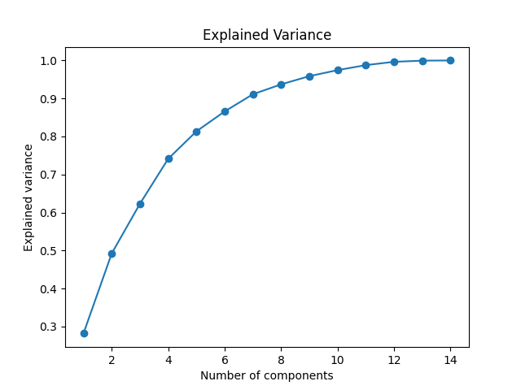

- Eigen Values Plot <br>
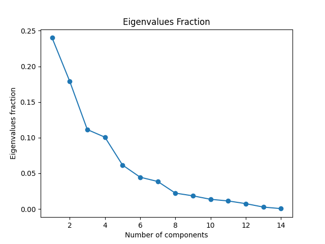

To capture 95% of the variance, we need 8 features.


### Evaluation
- Keeping all the features, with best k = 20 and best distance metric = 'manhattan', the scores are as follows:
```
Full Dataset
Accuracy: 0.2709343138893532
Micro Precision: 0.2709343138893532
Micro Recall: 0.2709343138893532
Micro F1: 0.2709343138893532
Macro Precision: 0.2573578888671874
Macro Recall: 0.2478699674397185
Macro F1: 0.24091608277387128
```
- Keeping the best 8 features, with best k = 20 and best distance metric = 'manhattan', the scores are as follows:
```
Reduced Dataset
Accuracy: 0.21232380634018608
Micro Precision: 0.21232380634018608
Micro Recall: 0.21232380634018608
Micro F1: 0.21232380634018608
Macro Precision: 0.2023337961950314
Macro Recall: 0.19550068347367766
Macro F1: 0.1896011645793315
```

We can see that the accuracy is less for the reduced dataset as compared to the full dataset. This is because we are reducing the dimensions and hence losing some information. But using only 8 features we are able to capute 95% of the variance and got a good accuracy.

Same is the case with the precision, recall and F1 scores.

Reducing the dimensions also reduces the inference time.<br>

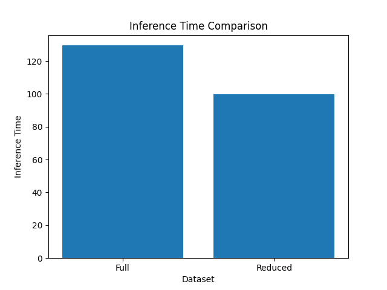

As we can see from the bar plot that the inference time for the reuced dataset is less as compared to the full dataset.