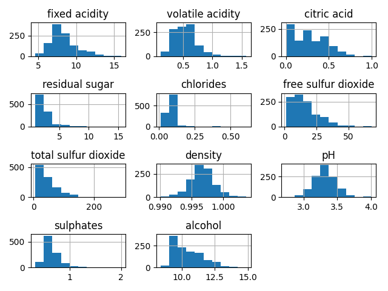
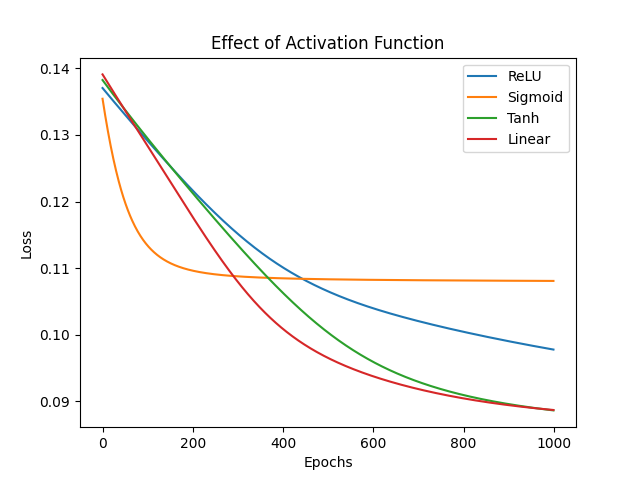
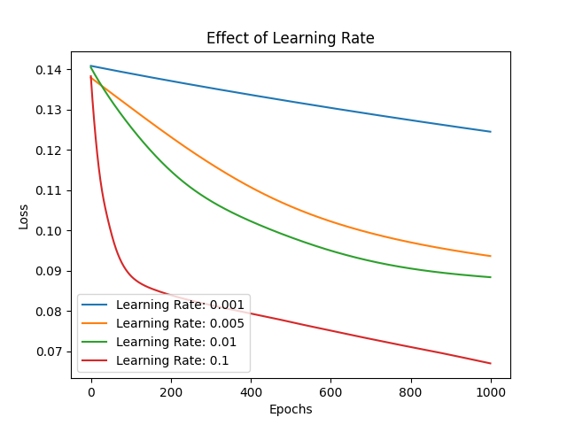
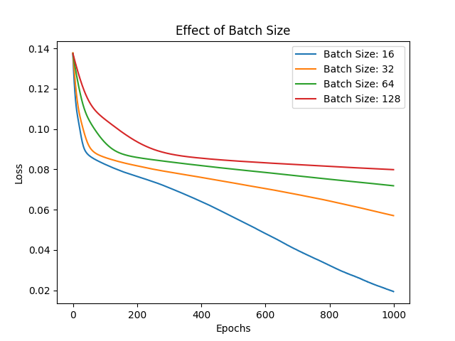
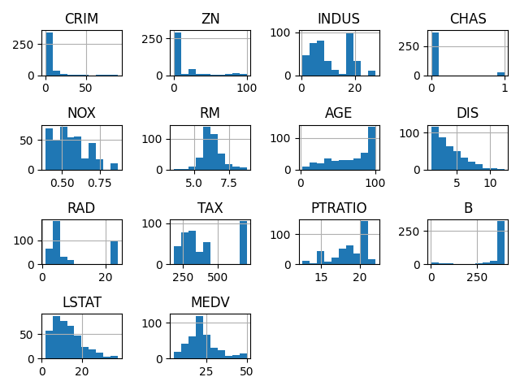
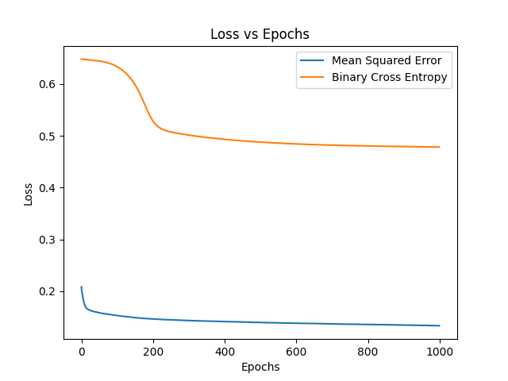
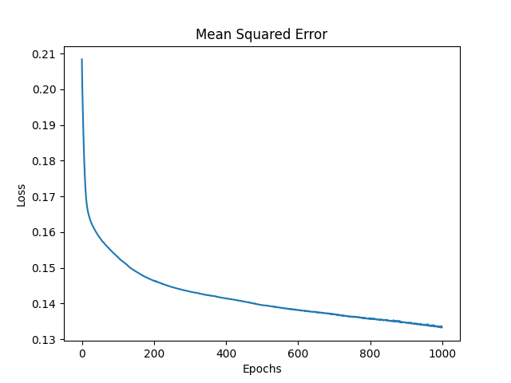
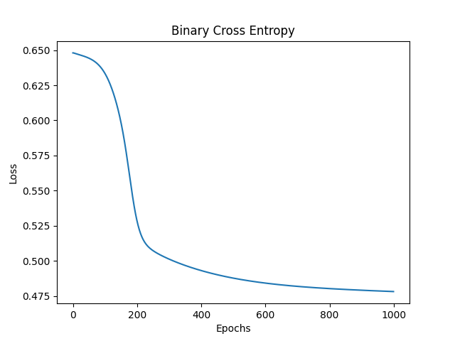
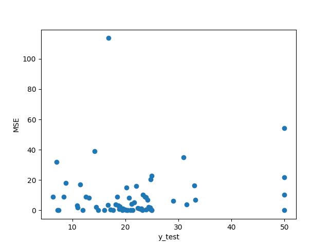

# Assigment 3

## Multi Layer Perceptron Classification

### Task 1: Dataset Analysis and Preprocessing

```
Mean:

fixed acidity            8.311111
volatile acidity         0.531339
citric acid              0.268364
residual sugar           2.532152
chlorides                0.086933
free sulfur dioxide     15.615486
total sulfur dioxide    45.914698
density                  0.996730
pH                       3.311015
sulphates                0.657708
alcohol                 10.442111
quality                  5.657043

Standard Deviation:

fixed acidity            1.747595
volatile acidity         0.179633
citric acid              0.196686
residual sugar           1.355917
chlorides                0.047267
free sulfur dioxide     10.250486
total sulfur dioxide    32.782130
density                  0.001925
pH                       0.156664
sulphates                0.170399
alcohol                  1.082196
quality                  0.805824

Min:

fixed acidity           4.60000
volatile acidity        0.12000
citric acid             0.00000
residual sugar          0.90000
chlorides               0.01200
free sulfur dioxide     1.00000
total sulfur dioxide    6.00000
density                 0.99007
pH                      2.74000
sulphates               0.33000
alcohol                 8.40000
quality                 3.00000

Max:

fixed acidity            15.90000
volatile acidity          1.58000
citric acid               1.00000
residual sugar           15.50000
chlorides                 0.61100
free sulfur dioxide      68.00000
total sulfur dioxide    289.00000
density                   1.00369
pH                        4.01000
sulphates                 2.00000
alcohol                  14.90000
quality                   8.00000

Test Metrics: 
Accuracy:  0.5217391304347826
Precision:  0.525681032229312
Recall:  0.5217391304347826
F1:  0.517904761904762
Loss:  5.013790467301617
```



### Task 2: Model Building from Scratch

MLP Class
```python

class MLP:
    def __init__(self, learning_rate=0.01, n_epochs=200, batch_size=32, neurons_per_layer=None,
                 activation_function='sigmoid', loss_function='cross_entropy', optimizer='sgd', early_stopping=False, patience=25):
        self.learning_rate = learning_rate
        self.n_epochs = n_epochs
        self.neurons_per_layer = neurons_per_layer
        self.activation_function = activation_function
        self.loss_function = loss_function
        self.optimizer = optimizer
        self.early_stopping = early_stopping
        self.patience = patience
        if optimizer == 'mini-batch':
            self.batch_size = batch_size
        elif optimizer == 'sgd':
            self.batch_size = 1

    def fit(self, X, Y, X_val=None, Y_val=None):
        self.X = X
        self.Y = Y
        self.n_samples, self.n_features = X.shape
        self.n_classes = Y.shape[1]

        if self.optimizer == 'batch':
            self.batch_size = self.n_samples
        self.weights, self.biases = self.initialize_weightsAndBiases()

        best_loss = np.inf
        patience_counter = 0

        for epoch in range(self.n_epochs):
            for i in range(0, self.n_samples, self.batch_size):
                X_batch = X[i:i+self.batch_size]
                Y_batch = Y[i:i+self.batch_size]

                self.forward_propagation(X_batch)
                grads_w, grads_b = self.backward_propagation(Y_batch)
                self.update_weights(grads_w, grads_b)
            
            # loss = self.compute_loss(self.X, self.Y)
            # print(f"Epoch {epoch+1}/{self.n_epochs} - Loss: {loss}")

            if X_val is not None and Y_val is not None:
                val_loss = self.compute_loss(X_val, Y_val)
                train_loss = self.compute_loss(self.X, self.Y)
                Y_val_pred = self.predict(X_val)
                Y_train_pred = self.predict(self.X)
                score_train = self.compute_metrics(Y_train_pred, self.Y)
                score_val = self.compute_metrics(Y_val_pred, Y_val)

                wandb.log({
                    'train_loss': train_loss,
                    'val_loss': val_loss,
                    'train_accuracy': score_train['accuracy'],
                    'val_accuracy': score_val['accuracy'],
                    'train_precision': score_train['precision'],
                    'val_precision': score_val['precision'],
                    'train_recall': score_train['recall'],
                    'val_recall': score_val['recall'],
                    'train_f1': score_train['f1'],
                    'val_f1': score_val['f1']
                })

                if self.early_stopping:
                    if val_loss < best_loss:
                        best_loss = val_loss
                        patience_counter = 0
                    else:
                        patience_counter += 1

                    if patience_counter >= self.patience:
                        print(f"Early stopping at epoch {epoch+1}")
                        break

    def initialize_weightsAndBiases(self):
        weights = {}
        biases = {}
        layers = [self.n_features] + self.neurons_per_layer + [self.n_classes]
        for i in range(len(layers) - 1):
            weights[i] = np.random.randn(layers[i], layers[i + 1]) * (np.sqrt(2/layers[i]))
            biases[i] = np.zeros((1,layers[i+1]))
        return weights, biases

    def forward_propagation(self, X):
        self.activations = {}
        self.activations[0] = X
        self.z = {}
        for i in range(1, len(self.weights) + 1):
            z = np.dot(self.activations[i - 1], self.weights[i - 1]) + self.biases[i - 1]
            self.z[i-1] = z
            if i == len(self.weights): 
                self.activations[i] = self.softmax(z)
            else:
                self.activations[i] = self.activation(z)
        return self.activations[len(self.weights)]

    def sigmoid(self, x):
        return 1 / (1 + np.exp(-x))

    def activation(self, x):
        if self.activation_function == 'sigmoid':
            return self.sigmoid(x)
        elif self.activation_function == 'relu':
            return np.maximum(0, x)
        elif self.activation_function == 'tanh':
            return np.tanh(x)
        elif self.activation_function == 'linear':
            return x

    def softmax(self, x):
        exp_x = np.exp(x - np.max(x, axis=1, keepdims=True))
        return exp_x / np.sum(exp_x, axis=1, keepdims=True)

    def activation_derivative(self, x):
        if self.activation_function == 'sigmoid':
            return self.sigmoid(x) * (1 - self.sigmoid(x))
        elif self.activation_function == 'relu':
            return 1. * np.where(x > 0, 1, 0)
        elif self.activation_function == 'tanh':
            return 1 - np.tanh(x) ** 2
        elif self.activation_function == 'linear':
            return 1

    def backward_propagation(self, Y):
        error = self.activations[len(self.weights)] - Y
        
        M = Y.shape[0]

        grads_w = {}
        grads_b = {}

        for i in range(len(self.weights)-1, -1, -1):
            grads_w[i] = np.dot(self.activations[i].T, error)/M  
            grads_b[i] = np.sum(error, axis=0, keepdims=True)/M
            if i > 0:
                error = np.dot(error, self.weights[i].T) * self.activation_derivative(self.z[i-1])
        return grads_w, grads_b


    def update_weights(self, grads_w, grads_b):
        for i in range(len(self.weights)):
            self.weights[i] -= self.learning_rate * grads_w[i]
            self.biases[i] -= self.learning_rate * grads_b[i]


    def compute_loss(self, X,Y):
        Y_pred = self.forward_propagation(X)
        M = Y.shape[0]
        return -np.sum(Y * np.log(Y_pred + 1e-15)) / M

    def compute_metrics(self, Y_pred, Y_true):
        metrics = {
            'accuracy': accuracy_score(Y_true, Y_pred),
            'precision': precision_score(Y_true, Y_pred, average='weighted', zero_division=0),
            'recall': recall_score(Y_true, Y_pred, average='weighted', zero_division=0),
            'f1': f1_score(Y_true, Y_pred, average='weighted', zero_division=0)
        }
        return metrics

    def predict(self, X):
        cur_pred = self.forward_propagation(X)
        one_hot_pred = np.zeros_like(cur_pred)
        one_hot_pred[np.arange(len(cur_pred)), cur_pred.argmax(1)] = 1
        return one_hot_pred

    def gradient_check(self, X, Y, epsilon=1e-7):
        self.forward_propagation(X)
        grads_w, grads_b = self.backward_propagation(Y)

        numerical_grads_w = {}
        numerical_grads_b = {}

        for i in range(len(self.weights)):
            numerical_grads_w[i] = np.zeros(self.weights[i].shape)
            for j in range(self.weights[i].shape[0]):
                for k in range(self.weights[i].shape[1]):
                    self.weights[i][j, k] += epsilon
                    loss_plus = self.compute_loss(X, Y)

                    self.weights[i][j, k] -= 2 * epsilon
                    loss_minus = self.compute_loss(X, Y)

                    self.weights[i][j, k] += epsilon
                    numerical_grads_w[i][j, k] = (loss_plus - loss_minus) / (2 * epsilon)

        for i in range(len(self.biases)):
            numerical_grads_b[i] = np.zeros(self.biases[i].shape)
            for j in range(self.biases[i].shape[1]):
                self.biases[i][0, j] += epsilon
                loss_plus = self.compute_loss(X, Y)

                self.biases[i][0, j] -= 2 * epsilon
                loss_minus = self.compute_loss(X, Y)

                self.biases[i][0, j] += epsilon
                numerical_grads_b[i][0, j] = (loss_plus - loss_minus) / (2 * epsilon)

        for i in range(len(self.weights)):
            diff_w = np.linalg.norm(grads_w[i] - numerical_grads_w[i]) / (np.linalg.norm(grads_w[i]) + np.linalg.norm(numerical_grads_w[i]) + 1e-8)
            if diff_w > 1e-4:
                print(f"Gradient check failed for weights at layer {i} with difference {diff_w}")
                return

        for i in range(len(self.biases)):
            diff_b = np.linalg.norm(grads_b[i] - numerical_grads_b[i]) / (np.linalg.norm(grads_b[i]) + np.linalg.norm(numerical_grads_b[i]) + 1e-8)
            if diff_b > 1e-4:
                print(f"Gradient check failed for biases at layer {i} with difference {diff_b}")
                return

        print("Gradient check passed")

```

### Task 3: Model Training & Hyperparameter Tuningusing W&B

The link of the wandbe sweep is following:
[Wandbe Sweep](https://wandb.ai/hy815088-iiit-hyderabad/mlp-classifier-sweep-3/sweeps/6cffsnau?nw=nwuserhy815088)

The parameters for best model that I got are:
```
activation_function: relu
batch_size: 128
learning_rate: 0.005
neurons_per_layer: [64, 32]
optimizer: batch
```
###

### Task 4: Evaluating Single-label Classification Model
On evaluating the model with the best hyperparameters, I got the following metrics:

```
Test Metrics:
Accuracy:  0.6173913043478261
Precision:  0.5815596963423051
Recall:  0.6173913043478261
F1:  0.5876645471730538
Loss:  1.101895309372894
```

### Task 5: Analyzing Hyperparameters Effects

- Effect of Non Linearity <br>


Here although the sigmoid converged faster but the loss is higher.
Most of the time relu and tanh are better than sigmoid (it depends on different runs).
In this particular case tanh is better than relu.

- Effect of Learning Rate <br>

With low learning rate the model converges slowly but with high learning rate the model converges faster but the loss is higher.

- Effect of Batch Size <br>


Small batch size converges faster but the loss is higher. Large batch size converges slower but the loss is lower.

### Task 6: Multi-Label Classification
Multi-Label Classification class.
```python
import numpy as np
import wandb
from sklearn.metrics import accuracy_score, precision_score, recall_score, f1_score

class MLP_multilabel:
    def __init__(self, learning_rate=0.01, n_epochs=200, batch_size=32, neurons_per_layer=None,
                 activation_function='sigmoid', loss_function='binary_cross_entropy', optimizer='sgd', early_stopping=False, patience=10):
        self.learning_rate = learning_rate
        self.n_epochs = n_epochs
        self.neurons_per_layer = neurons_per_layer
        self.activation_function = activation_function
        self.loss_function = loss_function
        self.optimizer = optimizer
        self.early_stopping = early_stopping
        self.patience = patience
        if optimizer == 'mini-batch':
            self.batch_size = batch_size
        elif optimizer == 'sgd':
            self.batch_size = 1

    def fit(self, X, Y, X_val=None, Y_val=None):
        self.X = X
        self.Y = Y
        self.n_samples, self.n_features = X.shape
        self.n_classes = Y.shape[1]

        if self.optimizer == 'batch':
            self.batch_size = self.n_samples
        
        self.weights, self.biases = self.initialize_weightsAndBiases()

        best_loss = np.inf
        patience_counter = 0

        for epoch in range(self.n_epochs):
            for i in range(0, self.n_samples, self.batch_size):
                X_batch = X[i:i+self.batch_size]
                Y_batch = Y[i:i+self.batch_size]

                self.forward_propagation(X_batch)
                grads_w, grads_b = self.backward_propagation(Y_batch)
                self.update_weights(grads_w, grads_b)
            
            loss = self.compute_loss(self.X, self.Y)
            print(f"Epoch {epoch+1}/{self.n_epochs} - Loss: {loss}")

            if X_val is not None and Y_val is not None:
                val_loss = self.compute_loss(X_val, Y_val)
                train_loss = self.compute_loss(self.X, self.Y)
                Y_val_pred = self.predict(X_val)
                Y_train_pred = self.predict(self.X)
                score_train = self.compute_metrics(Y_train_pred, self.Y)
                score_val = self.compute_metrics(Y_val_pred, Y_val)

                if self.early_stopping:
                    if val_loss < best_loss:
                        best_loss = val_loss
                        patience_counter = 0
                    else:
                        patience_counter += 1

                    if patience_counter >= self.patience:
                        print(f"Early stopping at epoch {epoch+1}")
                        break

    def initialize_weightsAndBiases(self):
        weights = {}
        biases = {}
        layers = [self.n_features] + self.neurons_per_layer + [self.n_classes]
        for i in range(len(layers) - 1):
            weights[i] = np.random.randn(layers[i], layers[i + 1])
            if self.activation_function == 'relu':
                weights[i] *= np.sqrt(2 / layers[i])
            else:
                weights[i] *= np.sqrt(1 / layers[i])
            biases[i] = np.zeros((1,layers[i+1]))
        return weights, biases

    def forward_propagation(self, X):
        self.activations = {}
        self.activations[0] = X
        self.z = {}
        for i in range(1, len(self.weights) + 1):
            z = np.dot(self.activations[i - 1], self.weights[i - 1]) + self.biases[i - 1]
            self.z[i-1] = z
            if i == len(self.weights): 
                self.activations[i] = self.sigmoid(z)
            else:
                self.activations[i] = self.activation(z)
        return self.activations[len(self.weights)]

    def sigmoid(self, x):
        return 1 / (1 + np.exp(-x))

    def activation(self, x):
        if self.activation_function == 'sigmoid':
            return self.sigmoid(x)
        elif self.activation_function == 'relu':
            return np.maximum(0, x)
        elif self.activation_function == 'tanh':
            return np.tanh(x)
        elif self.activation_function == 'linear':
            return x

    def activation_derivative(self, x):
        if self.activation_function == 'sigmoid':
            return self.sigmoid(x) * (1 - self.sigmoid(x))
        elif self.activation_function == 'relu':
            return 1. * np.where(x > 0, 1, 0)
        elif self.activation_function == 'tanh':
            return 1 - np.tanh(x) ** 2
        elif self.activation_function == 'linear':
            return 1

    def backward_propagation(self, Y):
        error = self.activations[len(self.weights)] - Y
        
        M = Y.shape[0]

        grads_w = {}
        grads_b = {}

        for i in range(len(self.weights)-1, -1, -1):
            grads_w[i] = np.dot(self.activations[i].T, error)/M  
            grads_b[i] = np.sum(error, axis=0, keepdims=True)/M
            if i > 0:
                error = np.dot(error, self.weights[i].T) * self.activation_derivative(self.z[i-1])
        return grads_w, grads_b


    def update_weights(self, grads_w, grads_b):
        for i in range(len(self.weights)):
            self.weights[i] -= self.learning_rate * grads_w[i]
            self.biases[i] -= self.learning_rate * grads_b[i]


    def compute_loss(self, X, Y):
        Y_pred = self.forward_propagation(X)
        M = Y.shape[0]
        return -np.sum(Y * np.log(Y_pred + 1e-15) + (1 - Y) * np.log(1 - Y_pred + 1e-15)) / M


    def compute_metrics(self, Y_pred, Y_true):
        metrics = {
            'accuracy': accuracy_score(Y_true, Y_pred),
            'precision': precision_score(Y_true, Y_pred, average='samples', zero_division=0),
            'recall': recall_score(Y_true, Y_pred, average='samples', zero_division=0),
            'f1': f1_score(Y_true, Y_pred, average='samples', zero_division=0)
        }
        return metrics


    def predict(self, X, threshold=0.5):
        cur_pred = self.forward_propagation(X)
        return (cur_pred >= threshold).astype(int)
```

On performing the multilabel classification given dataset follwing result obtained.
```
Hamming loss:  0.35125
Accuracy:  0.01323
Precision:  0.02380
Recall:  0.01176
F1:  0.01574  
```
Most of the time the model was giving almost zero accuracy. The results depends on the different runs.

### Task 7: Analysis

On making the frequency map for each labels the following results were obtained:

```
Correct Predictions:  {5: 35, 6: 21}
Incorrect Predictions:  {6: 26, 8: 2, 7: 13, 5: 12, 4: 3, 3: 3}
```
From the above map we can see that the class 5 has the highest correct predictions followed by the class 6. This is because in the data the class 5 and 6 have the highest frequency hence the model is trained well for these classes.
Note: The above map also varies with different runs.


## Multilayer Perceptron Regression

### Task 1: Data Preprocessing

```
Mean:

CRIM         3.690136
ZN          11.460660
INDUS       11.000863
CHAS         0.068528
NOX          0.553215
RM           6.280015
AGE         68.932741
DIS          3.805268
RAD          9.403553
TAX        406.431472
PTRATIO     18.537563
B          358.490939
LSTAT       12.769112
MEDV        22.359645

Standard Deviation:
 
CRIM         9.202423
ZN          23.954082
INDUS        6.908364
CHAS         0.252971
NOX          0.113112
RM           0.697985
AGE         27.888705
DIS          2.098571
RAD          8.633451
TAX        168.312419
PTRATIO      2.166460
B           89.283295
LSTAT        7.308430
MEDV         9.142979

Min:

CRIM         0.00632
ZN           0.00000
INDUS        0.46000
CHAS         0.00000
NOX          0.38900
RM           3.56100
AGE          2.90000
DIS          1.12960
RAD          1.00000
TAX        187.00000
PTRATIO     12.60000
B            2.60000
LSTAT        1.73000
MEDV         5.00000

Max:

CRIM        88.9762
ZN         100.0000
INDUS       27.7400
CHAS         1.0000
NOX          0.8710
RM           8.7800
AGE        100.0000
DIS         12.1265
RAD         24.0000
TAX        711.0000
PTRATIO     22.0000
B          396.9000
LSTAT       37.9700
MEDV        50.0000

Test Metrics:
MSE:  48.08802758545134
RMSE:  6.934553164079957
MAE:  5.054979866149926
R2:  -1.9306343202203609
```



### Task 2: MLP Regression Implementation from Scratch

MLP Regression class.
```python

class MLPR:
    def __init__(self, learning_rate=0.01, n_epochs=200, batch_size=32, neurons_per_layer=None,
                 activation_function='sigmoid', loss_function='mean_squared_error', optimizer='sgd', early_stopping=False, patience=30):
        self.learning_rate = learning_rate
        self.n_epochs = n_epochs
        self.batch_size = batch_size
        self.neurons_per_layer = neurons_per_layer
        self.activation_function = activation_function
        self.loss_function = loss_function
        self.optimizer = optimizer
        self.early_stopping = early_stopping
        self.patience = patience

    def fit(self, X, Y, X_val=None, Y_val=None):
        self.X = X
        self.Y = Y
        self.n_samples, self.n_features = X.shape
        self.n_classes = Y.shape[1] if len(Y.shape) > 1 else 1

        if self.optimizer == 'batch':
            self.batch_size = self.n_samples

        self.weights, self.biases = self.initialize_weights_and_biases()

        best_loss = np.inf
        patience_counter = 0
        self.loss_list = []
        for epoch in range(self.n_epochs):
            for i in range(0, self.n_samples, self.batch_size):
                X_batch = X[i:i + self.batch_size]
                Y_batch = Y[i:i + self.batch_size]

                self.forward_propagation(X_batch)
                grads_w, grads_b = self.backward_propagation(Y_batch)
                self.update_weights(grads_w, grads_b)

            loss = self.compute_loss(self.X, self.Y)
            self.loss_list.append(loss)
            # print(f"Epoch {epoch + 1}/{self.n_epochs} - Loss: {loss}")

            if X_val is not None and Y_val is not None:
                val_loss = self.compute_loss(X_val, Y_val.reshape(-1, 1))
                train_loss = self.compute_loss(self.X, self.Y)
                Y_val_pred = self.predict(X_val)
                Y_train_pred = self.predict(self.X)
                metrics_train = self.compute_metrics(Y_train_pred, self.Y)
                metrics_val = self.compute_metrics(Y_val_pred, Y_val.reshape(-1, 1))

                wandb.log({
                    'train_loss': train_loss,
                    'val_loss': val_loss,
                    'train_rmse': metrics_train['rmse'],
                    'val_rmse': metrics_val['rmse'],
                    'train_mae': metrics_train['mae'],
                    'val_mae': metrics_val['mae'],
                    'train_r_squared': metrics_train['r_squared'],
                    'val_r_squared': metrics_val['r_squared']
                })

                if self.early_stopping:
                    if val_loss < best_loss:
                        best_loss = val_loss
                        patience_counter = 0
                    else:
                        patience_counter += 1

                    if patience_counter >= self.patience:
                        print(f"Early stopping at epoch {epoch + 1}")
                        break

    def initialize_weights_and_biases(self):
        weights = {}
        biases = {}
        layers = [self.n_features] + self.neurons_per_layer + [self.n_classes]
        for i in range(len(layers) - 1):
            weights[i] = np.random.randn(layers[i], layers[i + 1]) * 0.1
            biases[i] = np.zeros((1, layers[i + 1]))
        return weights, biases

    def forward_propagation(self, X):
        self.activations = {}
        self.activations[0] = X
        self.z = {}
        for i in range(1, len(self.weights) + 1):
            z = np.dot(self.activations[i - 1], self.weights[i - 1]) + self.biases[i - 1]
            self.activations[i] = self.activation(z)
            self.z[i - 1] = z

    def sigmoid(self, x):
        x = np.clip(x, -500, 500)
        return 1 / (1 + np.exp(-x))

    def activation(self, x):
        if self.activation_function == 'sigmoid' or self.loss_function == 'binary_cross_entropy':
            return self.sigmoid(x)
        elif self.activation_function == 'relu':
            return np.maximum(0, x)
        elif self.activation_function == 'tanh':
            return np.tanh(x)
        elif self.activation_function == 'linear':
            return x

    def activation_derivative(self, x):
        if self.activation_function == 'sigmoid' or self.loss_function == 'binary_cross_entropy':
            return self.sigmoid(x) * (1 - self.sigmoid(x))
        elif self.activation_function == 'relu':
            return 1. * np.where(x > 0, 1, 0)
        elif self.activation_function == 'tanh':
            return 1 - np.tanh(x) ** 2
        elif self.activation_function == 'linear':
            return 1

    def backward_propagation(self, Y):
        error = self.activations[len(self.weights)] - Y
        
        M = Y.shape[0]

        grads_w = {}
        grads_b = {}

        for i in range(len(self.weights)-1, -1, -1):
            grads_w[i] = np.dot(self.activations[i].T, error)/M  
            grads_b[i] = np.sum(error, axis=0, keepdims=True)/M
            if i > 0:
                error = np.dot(error, self.weights[i].T) * self.activation_derivative(self.z[i-1])
        return grads_w, grads_b

    def update_weights(self, grads_w, grads_b):
        for i in range(len(self.weights)):
            self.weights[i] -= self.learning_rate * grads_w[i]
            self.biases[i] -= self.learning_rate * grads_b[i]

    def compute_loss(self, X, Y):
        self.forward_propagation(X)
        Y_pred = self.activations[len(self.weights)]
        if self.loss_function == 'mean_squared_error':
            return np.mean((Y - Y_pred) ** 2)
        elif self.loss_function == 'mean_absolute_error':
            return np.mean(np.abs(Y - Y_pred))
        elif self.loss_function == 'binary_cross_entropy':
            epsilon = 1e-12
            Y_pred = np.clip(Y_pred, epsilon, 1. - epsilon)
            return -np.mean(Y * np.log(Y_pred) + (1 - Y) * np.log(1 - Y_pred))
        
    def mean_squared_error(self, Y_true, Y_pred):
        return np.mean((Y_true - Y_pred) ** 2)
    
    def mean_absolute_error(self, Y_true, Y_pred):
        return np.mean(np.abs(Y_true - Y_pred))
    
    def r_squared(self, Y_true, Y_pred):
        ss_total = np.sum((Y_true - np.mean(Y_true)) ** 2)
        ss_residual = np.sum((Y_true - Y_pred) ** 2)
        if ss_total == 0:
            return 0
        return 1 - (ss_residual / ss_total)

    def compute_metrics(self, Y_pred, Y_true):
        metrics = {
            'mse': self.mean_squared_error(Y_true, Y_pred),
            'rmse': np.sqrt(self.mean_squared_error(Y_true, Y_pred)),
            'mae': self.mean_absolute_error(Y_true, Y_pred),
            'r_squared': self.r_squared(Y_true, Y_pred)
        }
        return metrics

    def predict(self, X):
        self.forward_propagation(X)
        return self.activations[len(self.weights)]
    
    def gradient_check(self, X, Y, epsilon=1e-7):
        self.forward_propagation(X)
        grads_w, grads_b = self.backward_propagation(Y)

        numerical_grads_w = {}
        numerical_grads_b = {}

        for i in range(len(self.weights)):
            numerical_grads_w[i] = np.zeros(self.weights[i].shape)
            for j in range(self.weights[i].shape[0]):
                for k in range(self.weights[i].shape[1]):
                    self.weights[i][j, k] += epsilon
                    loss_plus = self.compute_metrics(X, Y)['mse']

                    self.weights[i][j, k] -= 2 * epsilon
                    loss_minus = self.compute_metrics(X, Y)['mse']

                    self.weights[i][j, k] += epsilon
                    numerical_grads_w[i][j, k] = (loss_plus - loss_minus) / (2 * epsilon)

        for i in range(len(self.biases)):
            numerical_grads_b[i] = np.zeros(self.biases[i].shape)
            for j in range(self.biases[i].shape[1]):
                self.biases[i][0, j] += epsilon
                loss_plus = self.compute_metrics(X, Y)['mse']

                self.biases[i][0, j] -= 2 * epsilon
                loss_minus = self.compute_metrics(X, Y)['mse']

                self.biases[i][0, j] += epsilon
                numerical_grads_b[i][0, j] = (loss_plus - loss_minus) / (2 * epsilon)

        if (numerical_grads_b[0][0][0]!=0):
            coeff = grads_b[0][0][0] / numerical_grads_b[0][0][0]
            numerical_grads_w = {k: v * coeff for k, v in numerical_grads_w.items()}
            numerical_grads_b = {k: v * coeff for k, v in numerical_grads_b.items()}

        for i in range(len(self.weights)):
            diff_w = np.linalg.norm(grads_w[i] - numerical_grads_w[i]) / (np.linalg.norm(grads_w[i]) + np.linalg.norm(numerical_grads_w[i]) + 1e-8)
            if diff_w > 1e-4:
                print(f"Gradient check failed for weights at layer {i} with difference {diff_w}")
                return

        for i in range(len(self.biases)):
            diff_b = np.linalg.norm(grads_b[i] - numerical_grads_b[i]) / (np.linalg.norm(grads_b[i]) + np.linalg.norm(numerical_grads_b[i]) + 1e-8)
            if diff_b > 1e-4:
                print(f"Gradient check failed for biases at layer {i} with difference {diff_b}")
                return

        print("Gradient check passed")
```

### Task 3: Model Training & Hyperparameter Tuning using W&B

Here is the link to the wandb sweep:
[Wandbe Sweep](https://wandb.ai/hy815088-iiit-hyderabad/mlp-regression/sweeps/8tni6n9h?nw=nwuserhy815088)

The parameters for best model that I got are:
```
activation_function: relu
batch_size: 16
learning_rate: 0.001
neurons_per_layer: [64, 32, 16]
optimizer: sgd
```

### Task 4: Evaluating Regression Model

On evaluating the model with the best hyperparameters, I got the following metrics:

```
Gradient check passed
Test Metrics:
MSE:  46.71140051867059
RMSE:  6.834573909079525
MAE:  4.674548236235334
R2:  -1.846738375000255
```

### Task 5: Mean Squared Error vs Binary Cross Entropy






From above plots we can see that BCE conveges faster that the MSE.
This is because BCE directly penalizes the incorrect prbablities and hence the model learns faster.

### Task 6: Analysis



Here from plot the plot we can see that the MSEs around 20 are less as the data around 20 is more(Except Outliers). The model is trained well for the data around 20.

### Task 7: Bonus

Merged Class
```python
class MLP_merged:
    def __init__(self, learning_rate=0.01, n_epochs=200, batch_size=32, neurons_per_layer=None,
                 activation_function='sigmoid', loss_function='mean_squared_error', optimizer='sgd', early_stopping=False, patience=30, is_classification=True):
        self.learning_rate = learning_rate
        self.n_epochs = n_epochs
        self.batch_size = batch_size
        self.neurons_per_layer = neurons_per_layer
        self.activation_function = activation_function
        self.loss_function = loss_function
        self.optimizer = optimizer
        self.early_stopping = early_stopping
        self.patience = patience
        self.is_classification = is_classification

    def fit(self, X, Y, X_val=None, Y_val=None):
        self.X = X
        self.Y = Y
        self.n_samples, self.n_features = X.shape
        self.n_classes = Y.shape[1] if len(Y.shape) > 1 else 1

        if self.optimizer == 'batch':
            self.batch_size = self.n_samples

        self.weights, self.biases = self.initialize_weights_and_biases()

        best_loss = np.inf
        patience_counter = 0
        self.loss_list = []
        for epoch in range(self.n_epochs):
            for i in range(0, self.n_samples, self.batch_size):
                X_batch = X[i:i + self.batch_size]
                Y_batch = Y[i:i + self.batch_size]
                self.forward_propagation(X_batch)
                grads_w, grads_b = self.backward_propagation(Y_batch)
                self.update_weights(grads_w, grads_b)

            loss = self.compute_loss(self.X, self.Y)
            self.loss_list.append(loss)
            # print(f"Epoch {epoch + 1}/{self.n_epochs} - Loss: {loss}")

            if X_val is not None and Y_val is not None:
                if self.is_classification:
                    val_loss = self.compute_loss(X_val, Y_val)
                    train_loss = self.compute_loss(self.X, self.Y)
                    Y_val_pred = self.predict(X_val)
                    Y_train_pred = self.predict(self.X)
                    score_train = self.compute_metrics_classification(Y_train_pred, self.Y)
                    score_val = self.compute_metrics_classification(Y_val_pred, Y_val)

                    wandb.log({
                        'train_loss': train_loss,
                        'val_loss': val_loss,
                        'train_accuracy': score_train['accuracy'],
                        'val_accuracy': score_val['accuracy'],
                        'train_precision': score_train['precision'],
                        'val_precision': score_val['precision'],
                        'train_recall': score_train['recall'],
                        'val_recall': score_val['recall'],
                        'train_f1': score_train['f1'],
                        'val_f1': score_val['f1']
                    })
                else:
                    val_loss = self.compute_loss(X_val, Y_val.reshape(-1, 1))
                    train_loss = self.compute_loss(self.X, self.Y)
                    Y_val_pred = self.predict(X_val)
                    Y_train_pred = self.predict(self.X)
                    metrics_train = self.compute_metrics_regression(Y_train_pred, self.Y)
                    metrics_val = self.compute_metrics_regression(Y_val_pred, Y_val.reshape(-1, 1))


                    wandb.log({
                        'train_loss': train_loss,
                        'val_loss': val_loss,
                        'train_rmse': metrics_train['rmse'],
                        'val_rmse': metrics_val['rmse'],
                        'train_mae': metrics_train['mae'],
                        'val_mae': metrics_val['mae'],
                        'train_r_squared': metrics_train['r_squared'],
                        'val_r_squared': metrics_val['r_squared']
                    })

                if self.early_stopping:
                    if val_loss < best_loss:
                        best_loss = val_loss
                        patience_counter = 0
                    else:
                        patience_counter += 1

                    if patience_counter >= self.patience:
                        print(f"Early stopping at epoch {epoch + 1}")
                        break

    def initialize_weights_and_biases(self):
        weights = {}
        biases = {}
        layers = [self.n_features] + self.neurons_per_layer + [self.n_classes]
        for i in range(len(layers) - 1):
            weights[i] = np.random.randn(layers[i], layers[i + 1]) * 0.1
            biases[i] = np.zeros((1, layers[i + 1]))
        return weights, biases
    
    def softmax(self, x):
        exp_x = np.exp(x - np.max(x, axis=1, keepdims=True))
        return exp_x / np.sum(exp_x, axis=1, keepdims=True)

    def forward_propagation(self, X):
        self.activations = {}
        self.activations[0] = X
        self.z = {}
        for i in range(1, len(self.weights) + 1):
            z = np.dot(self.activations[i - 1], self.weights[i - 1]) + self.biases[i - 1]
            self.z[i-1] = z
            if i == len(self.weights): 
                if self.is_classification:
                    self.activations[i] = self.softmax(z)
                else:
                    self.activations[i] = self.activation(z)
            else:
                self.activations[i] = self.activation(z)
        return self.activations[len(self.weights)]
    
    def sigmoid(self, x):
        x = np.clip(x, -500, 500)
        return 1 / (1 + np.exp(-x))

    def activation(self, x):
        if self.activation_function == 'sigmoid' or self.loss_function == 'binary_cross_entropy':
            return self.sigmoid(x)
        elif self.activation_function == 'relu':
            return np.maximum(0, x)
        elif self.activation_function == 'tanh':
            return np.tanh(x)
        elif self.activation_function == 'linear':
            return x

    def activation_derivative(self, x):
        if self.activation_function == 'sigmoid' or self.loss_function == 'binary_cross_entropy':
            return self.sigmoid(x) * (1 - self.sigmoid(x))
        elif self.activation_function == 'relu':
            return 1. * np.where(x > 0, 1, 0)
        elif self.activation_function == 'tanh':
            return 1 - np.tanh(x) ** 2
        elif self.activation_function == 'linear':
            return 1

    def backward_propagation(self, Y):
        error = self.activations[len(self.weights)] - Y
        
        M = Y.shape[0]

        grads_w = {}
        grads_b = {}

        for i in range(len(self.weights)-1, -1, -1):
            grads_w[i] = np.dot(self.activations[i].T, error)/M  
            grads_b[i] = np.sum(error, axis=0, keepdims=True)/M
            if i > 0:
                error = np.dot(error, self.weights[i].T) * self.activation_derivative(self.z[i-1])
        return grads_w, grads_b

    def update_weights(self, grads_w, grads_b):
        for i in range(len(self.weights)):
            self.weights[i] -= self.learning_rate * grads_w[i]
            self.biases[i] -= self.learning_rate * grads_b[i]

    def compute_loss(self, X, Y):
        self.forward_propagation(X)
        Y_pred = self.activations[len(self.weights)]
        if self.loss_function == 'mean_squared_error':
            return np.mean((Y - Y_pred) ** 2)
        elif self.loss_function == 'mean_absolute_error':
            return np.mean(np.abs(Y - Y_pred))
        elif self.loss_function == 'binary_cross_entropy':
            epsilon = 1e-12
            Y_pred = np.clip(Y_pred, epsilon, 1. - epsilon)
            return -np.mean(Y * np.log(Y_pred) + (1 - Y) * np.log(1 - Y_pred))
        elif self.loss_function == 'cross_entropy':
            return -np.sum(Y * np.log(Y_pred + 1e-15)) / Y.shape[0]
        
    def mean_squared_error(self, Y_true, Y_pred):
        return np.mean((Y_true - Y_pred) ** 2)
    
    def mean_absolute_error(self, Y_true, Y_pred):
        return np.mean(np.abs(Y_true - Y_pred))
    
    def r_squared(self, Y_true, Y_pred):
        ss_total = np.sum((Y_true - np.mean(Y_true)) ** 2)
        ss_residual = np.sum((Y_true - Y_pred) ** 2)
        if ss_total == 0:
            return 0
        return 1 - (ss_residual / ss_total)

    def compute_metrics_regression(self, Y_pred, Y_true):
        metrics = {
            'mse': self.mean_squared_error(Y_true, Y_pred),
            'rmse': np.sqrt(self.mean_squared_error(Y_true, Y_pred)),
            'mae': self.mean_absolute_error(Y_true, Y_pred),
            'r_squared': self.r_squared(Y_true, Y_pred)
        }
        return metrics
    
    def compute_metrics_classification(self, Y_pred, Y_true):
        metrics = {
            'accuracy': accuracy_score(Y_true, Y_pred),
            'precision': precision_score(Y_true, Y_pred, average='weighted', zero_division=0),
            'recall': recall_score(Y_true, Y_pred, average='weighted', zero_division=0),
            'f1': f1_score(Y_true, Y_pred, average='weighted', zero_division=0)
        }
        return metrics

    def predict(self, X):
        Y_pred = self.forward_propagation(X)
        if self.is_classification:
            one_hot_pred = np.zeros_like(Y_pred)
            one_hot_pred[np.arange(len(Y_pred)), Y_pred.argmax(1)] = 1
            return one_hot_pred
        return Y_pred
        
    
    def gradient_check(self, X, Y, epsilon=1e-7):
        self.forward_propagation(X)
        grads_w, grads_b = self.backward_propagation(Y)

        numerical_grads_w = {}
        numerical_grads_b = {}

        for i in range(len(self.weights)):
            numerical_grads_w[i] = np.zeros(self.weights[i].shape)
            for j in range(self.weights[i].shape[0]):
                for k in range(self.weights[i].shape[1]):
                    self.weights[i][j, k] += epsilon
                    loss_plus = self.compute_loss(X,Y)

                    self.weights[i][j, k] -= 2 * epsilon
                    loss_minus = self.compute_loss(X,Y)

                    self.weights[i][j, k] += epsilon
                    numerical_grads_w[i][j, k] = (loss_plus - loss_minus) / (2 * epsilon)

        for i in range(len(self.biases)):
            numerical_grads_b[i] = np.zeros(self.biases[i].shape)
            for j in range(self.biases[i].shape[1]):
                self.biases[i][0, j] += epsilon
                loss_plus = self.compute_loss(X,Y)

                self.biases[i][0, j] -= 2 * epsilon
                loss_minus = self.compute_loss(X,Y)

                self.biases[i][0, j] += epsilon
                numerical_grads_b[i][0, j] = (loss_plus - loss_minus) / (2 * epsilon)

        if not self.is_classification:
            coeff = grads_b[0][0][0] / numerical_grads_b[0][0][0]
            numerical_grads_w = {k: v * coeff for k, v in numerical_grads_w.items()}
            numerical_grads_b = {k: v * coeff for k, v in numerical_grads_b.items()}

        for i in range(len(self.weights)):
            diff_w = np.linalg.norm(grads_w[i] - numerical_grads_w[i]) / (np.linalg.norm(grads_w[i]) + np.linalg.norm(numerical_grads_w[i]) + 1e-8)
            if diff_w > 1e-4:
                print(f"Gradient check failed for weights at layer {i} with difference {diff_w}")
                return

        for i in range(len(self.biases)):
            diff_b = np.linalg.norm(grads_b[i] - numerical_grads_b[i]) / (np.linalg.norm(grads_b[i]) + np.linalg.norm(numerical_grads_b[i]) + 1e-8)
            if diff_b > 1e-4:
                print(f"Gradient check failed for biases at layer {i} with difference {diff_b}")
                return

        print("Gradient check passed")

```

## AutoEncoders

### Task 1: AutoEncoder implementation from scratch

AutoEncoder class.
```python
class AutoEncoder:
    def __init__(self, input_dim, latent_dim, learning_rate=0.01, n_epochs=200, batch_size=32, 
                 neurons_per_layer=None, activation_function='relu', loss_function='mean_squared_error', 
                 optimizer='sgd', early_stopping=False, patience=10):
        self.input_dim = input_dim
        self.latent_dim = latent_dim

        autoencoder_layers = neurons_per_layer[:-1] + [latent_dim] + neurons_per_layer[::-1] + [input_dim]
        self.autoencoder = MLPR(learning_rate=learning_rate, n_epochs=n_epochs, batch_size=batch_size, 
                                neurons_per_layer=autoencoder_layers, activation_function=activation_function, 
                                loss_function=loss_function, optimizer=optimizer, early_stopping=early_stopping, 
                                patience=patience)

    def fit(self, X):
        self.autoencoder.fit(X, X)

    def get_latent(self, X):
        self.autoencoder.forward_propagation(X)
        activations = self.autoencoder.activations
        latent_rep = activations[len(self.autoencoder.neurons_per_layer) // 2]
        return latent_rep

    def reconstruct(self, X):
        return self.autoencoder.predict(X)
```


### Task 2-4:  Train the autoencoder, AutoEncoder + KNN,  MLP classification

- KNN
- Performance for Reduced dataset using AutoEncoder for latent_dim = 8

``` 
Accuracy:  0.21744944008022732
Micro Precision:  0.217667726284089
Micro Recall:  0.217667726284089
Micro F1:  0.217667726284089
Macro Precision:  0.19998930536851317
Macro Recall:  0.2035806933508997
Macro F1:  0.19374885413204795
```
PCA
- Keeping all the features, with best k = 20 and best distance metric = 'manhattan', the scores are as follows:
```

Full Dataset
Accuracy: 0.2709343138893532
Micro Precision: 0.2709343138893532
Micro Recall: 0.2709343138893532
Micro F1: 0.2709343138893532
Macro Precision: 0.2573578888671874
Macro Recall: 0.2478699674397185
Macro F1: 0.24091608277387128
```

- Keeping the best 8 features, with best k = 20 and best distance metric = 'manhattan', the scores are as follows:
```
Accuracy: 0.21232380634018608
Micro Precision: 0.21232380634018608
Micro Recall: 0.21232380634018608
Micro F1: 0.21232380634018608
Macro Precision: 0.2023337961950314
Macro Recall: 0.19550068347367766
Macro F1: 0.1896011645793315
```
Here the autoencoder results are close to the results of PCA. But this is very rare that autoencoder results are close to PCA results.
Autoecoder results are heavily dependent on the different runs.
Most of the time the autoencoder results are worse than PCA results.

- MLP
```
Performance for Reduced dataset using AutoEncoder
Accuracy:  0.24096049919215556
Precision:  0.22147008250410197
Recall:  0.24096049919215556
F1:  0.21242616690063498
Loss:  2.98001393206514
```
MLP Classifier does better that the KNN on the reduced dataset using AutoEncoder.