# Assigment 3

## KDE

### Task 1: KDE Class

```python
class KDE:
    def __init__(self, kernel='gaussian', bandwidth=1.0):
        self.kernel = kernel
        self.bandwidth = bandwidth
        self.data = None

    def kernel_fun(self, distance):
        if self.kernel == 'box':
            return np.where(np.abs(distance) <= 1, 0.5, 0)
        elif self.kernel == 'gaussian':
            return (1 / np.sqrt(2 * np.pi)) * np.exp(-0.5 * distance ** 2)
        elif self.kernel == 'triangular':
            return np.maximum(1 - np.abs(distance), 0)
        
    def fit(self, data):
        self.data = np.asarray(data)

    def predict(self, x):
        distances = np.linalg.norm((self.data - x) / self.bandwidth, axis=1)
        kernel_values = self.kernel_fun(distances)
        return np.mean(kernel_values) / (self.bandwidth ** self.data.shape[1])

    def visualize(self, x_range, y_range, resolution=100):
        x = np.linspace(x_range[0], x_range[1], resolution)
        y = np.linspace(y_range[0], y_range[1], resolution)
        X, Y = np.meshgrid(x, y)
        positions = np.c_[X.ravel(), Y.ravel()]
        Z = np.array([])
        for pos in positions:
            Z = np.append(Z, self.predict(pos))
        Z = Z.reshape(X.shape)

        plt.figure(figsize=(8, 8))
        plt.contourf(X, Y, Z, cmap='viridis')
        # plt.scatter(self.data[:, 0], self.data[:, 1], s=5, color='red')
        plt.xlabel('X')
        plt.ylabel('Y')
        plt.title(f'KDE Density Visualization ({self.kernel} kernel)')
        plt.colorbar(label='Density')
        plt.savefig(f'./figures/KDE_{self.kernel}_kernel_{int(self.bandwidth*100)}.png')

```

### Task 2 : Generate Synthetic Data

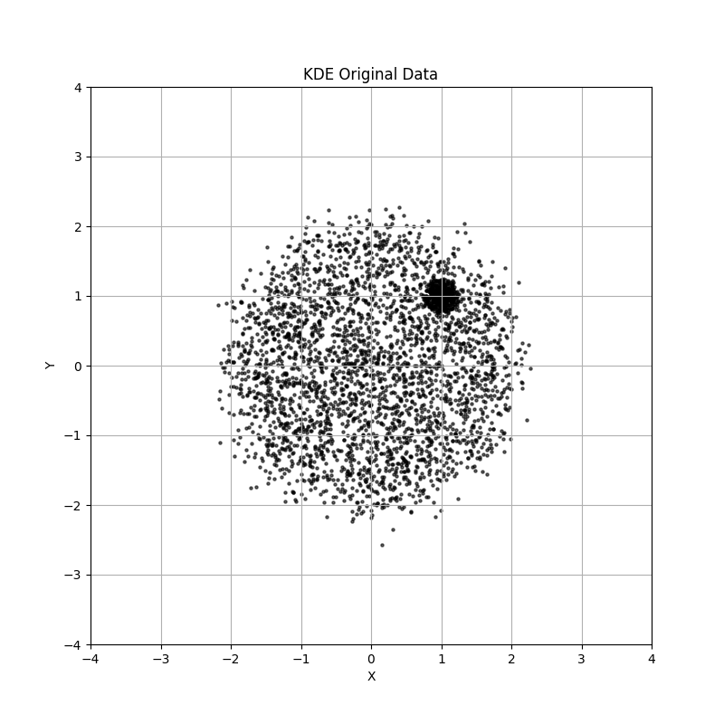 <br>

### Task 3 : KDE vs GMM

#### KDE

 <br>

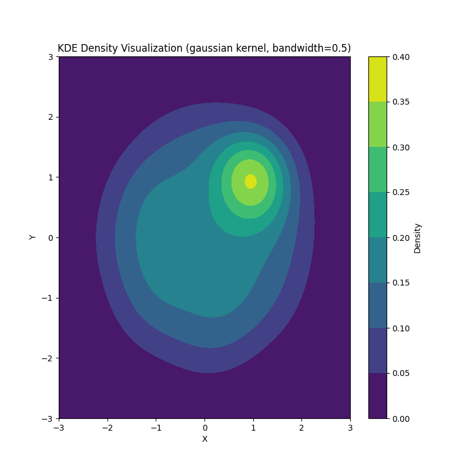 <br>

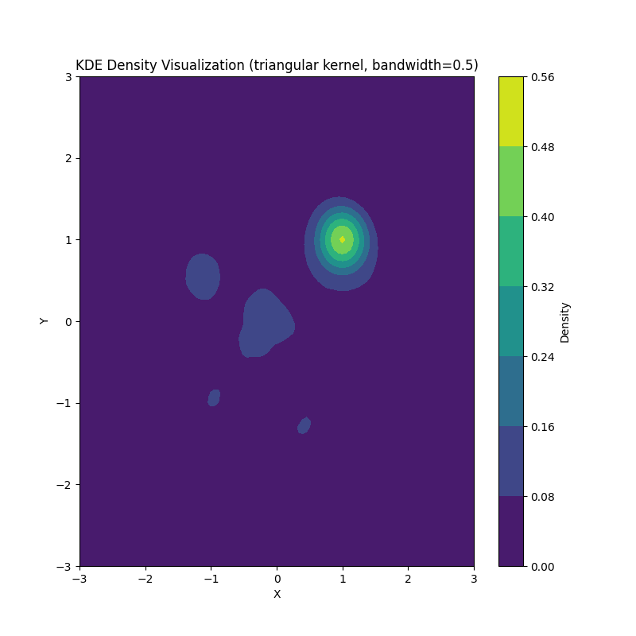 <br>

 <br>

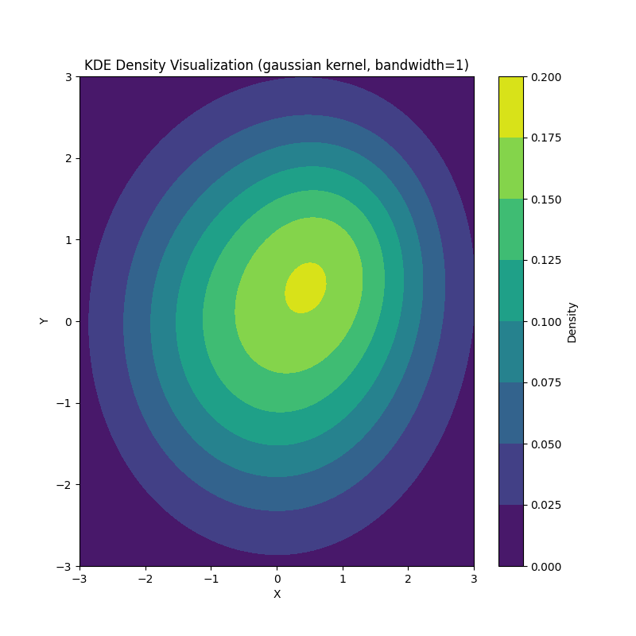 <br>

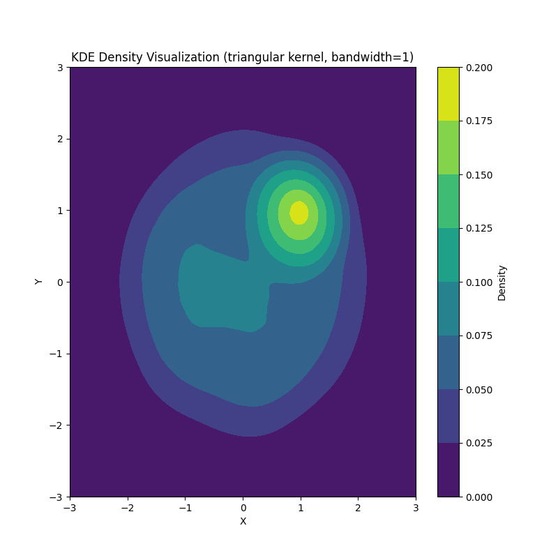 <br>

#### GMM

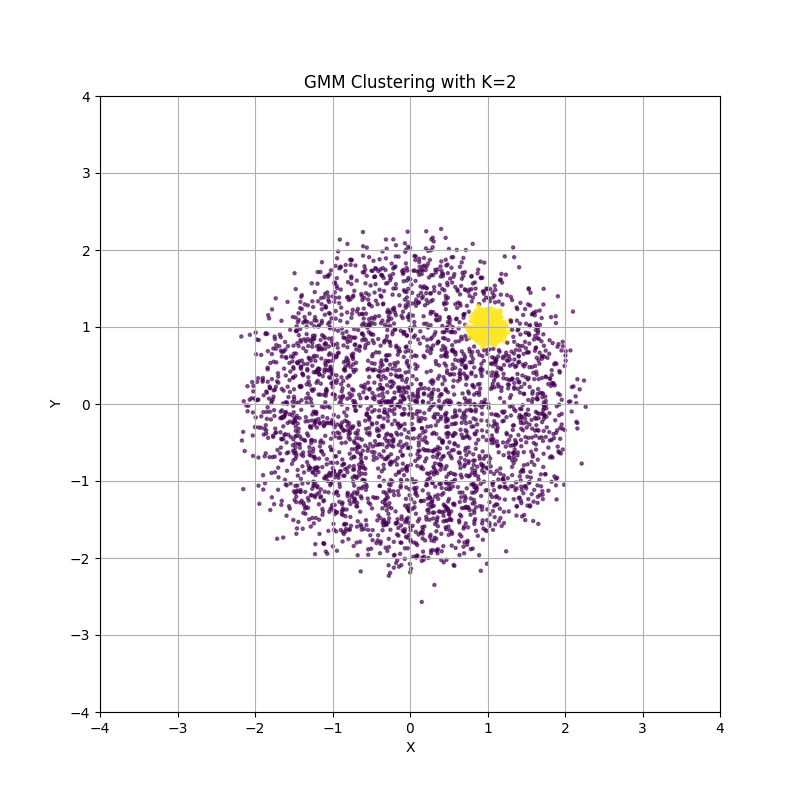 <br>

 <br>

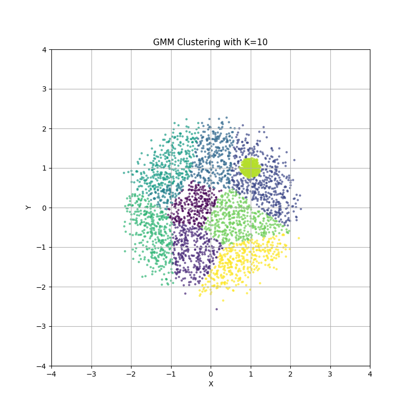 <br>

- When we used 2 component in GMM then the model perfectly fits the data but boundaried are not captured by GMM.
- On increasing the number of components GMM overfits.

- KDE consistantly fits data for lower bandwidth with gaussian kernel. For other kernels it captures noise at random locations.

- But for higher bandwidth KDE smooths out the details and tries to fit the data.


## HMMs

### Dataset

 <br>

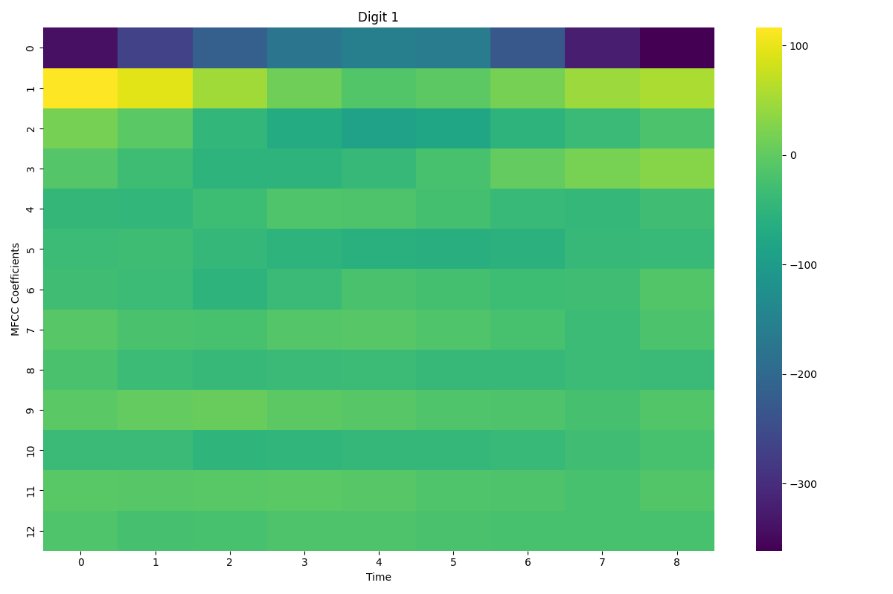 <br>

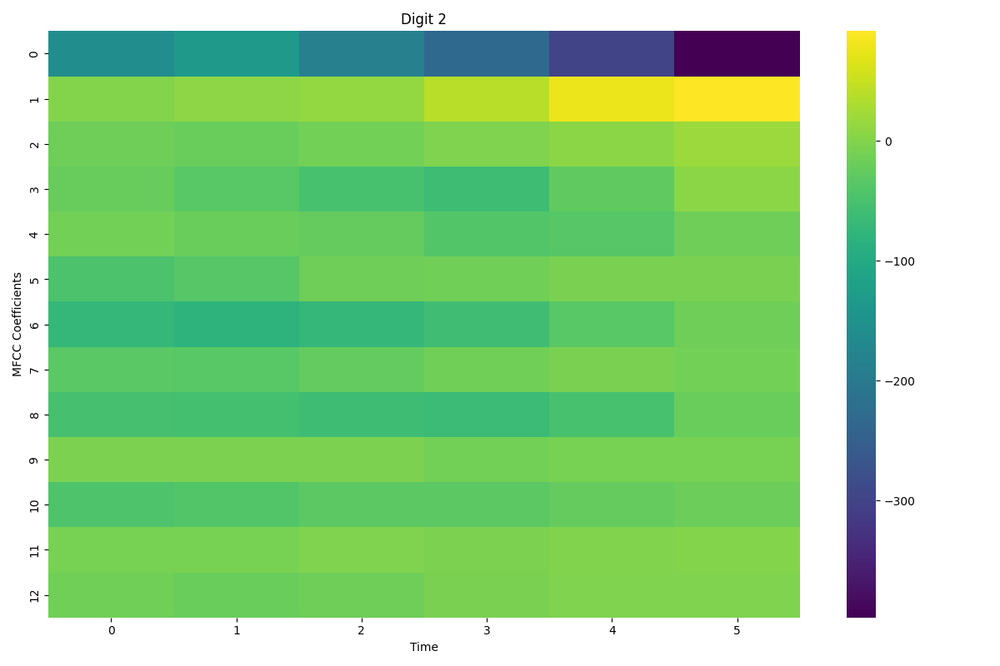 <br>

 <br>

 <br>

 <br>

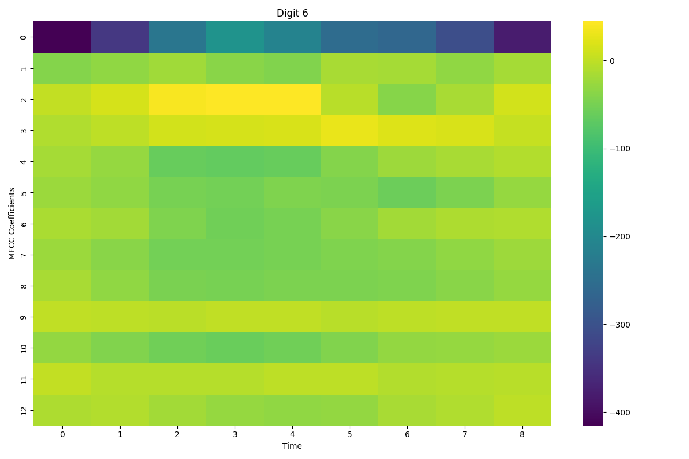 <br>

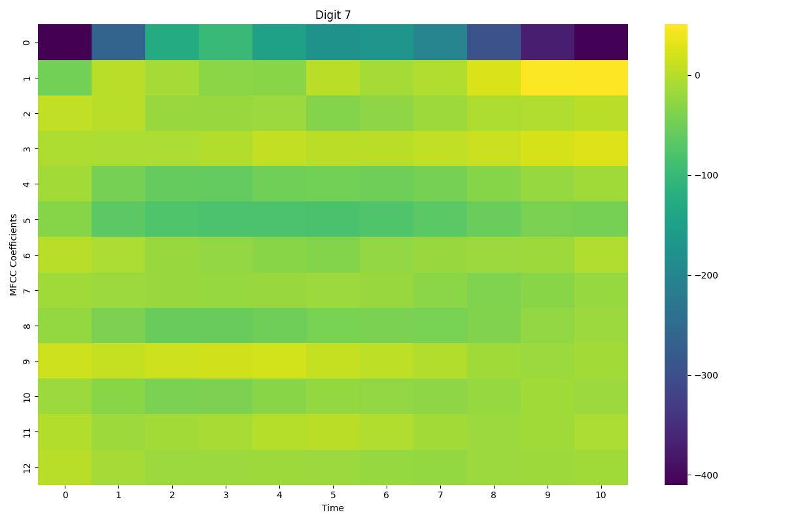 <br>

 <br>

 <br>

- HMMs are a good fit for recognizing spoken digits because speech changes over time, and HMMs are designed to handle data that follows a sequence. MFCC features capture how the sound of speech changes over time. Each digit has its own unique pattern in these features, which helps HMMs learn the different sounds in each digit. This makes HMMs effective at recognizing digits since they can understand the flow of speech.


### Model Architecture
```python
models = {}
for digit, features in train_data.items():
    X = np.concatenate(features)
    lengths = [feature.shape[0] for feature in features]
    model = hmm.GaussianHMM(n_components=5, covariance_type="diag", n_iter=100)
    model.fit(X, lengths)
    models[digit] = model

def predict_digit(mfcc):
    log_likelihoods = {}
    for digit, model in models.items():
        log_likelihood = model.score(mfcc)
        log_likelihoods[digit] = log_likelihood
    return max(log_likelihoods, key=log_likelihoods.get)

def evaluate_accuracy(data):
    correct = 0
    total = 0
    for digit, features in data.items():
        for mfcc in features:
            prediction = predict_digit(mfcc)
            if prediction == digit:
                correct += 1
            total += 1
    accuracy = correct / total
    return accuracy
```

### Metrics

```
Recognition Accuracy on Test Set: 92.33%
``` 

Accuracy on my recordings if I am adding 5 samples for each digit in only the test set
```
Recognition Accuracy on My Recordings: 10.00%
```

Predictions on my recordings
```
True Digit: 0, Predicted Digit: 1
True Digit: 0, Predicted Digit: 1
True Digit: 0, Predicted Digit: 1
True Digit: 0, Predicted Digit: 1
True Digit: 0, Predicted Digit: 1
True Digit: 1, Predicted Digit: 1
True Digit: 1, Predicted Digit: 1
True Digit: 1, Predicted Digit: 1
True Digit: 1, Predicted Digit: 1
True Digit: 1, Predicted Digit: 1
True Digit: 2, Predicted Digit: 1
True Digit: 2, Predicted Digit: 1
True Digit: 2, Predicted Digit: 1
True Digit: 2, Predicted Digit: 1
True Digit: 2, Predicted Digit: 1
True Digit: 3, Predicted Digit: 1
True Digit: 3, Predicted Digit: 1
True Digit: 3, Predicted Digit: 1
True Digit: 3, Predicted Digit: 1
True Digit: 3, Predicted Digit: 1
True Digit: 4, Predicted Digit: 0
True Digit: 4, Predicted Digit: 1
True Digit: 4, Predicted Digit: 0
True Digit: 4, Predicted Digit: 0
True Digit: 4, Predicted Digit: 0
True Digit: 5, Predicted Digit: 1
True Digit: 5, Predicted Digit: 1
True Digit: 5, Predicted Digit: 1
True Digit: 5, Predicted Digit: 1
True Digit: 5, Predicted Digit: 1
True Digit: 6, Predicted Digit: 1
True Digit: 6, Predicted Digit: 1
True Digit: 6, Predicted Digit: 1
True Digit: 6, Predicted Digit: 0
True Digit: 6, Predicted Digit: 4
True Digit: 7, Predicted Digit: 1
True Digit: 7, Predicted Digit: 1
True Digit: 7, Predicted Digit: 1
True Digit: 7, Predicted Digit: 1
True Digit: 7, Predicted Digit: 1
True Digit: 8, Predicted Digit: 1
True Digit: 8, Predicted Digit: 1
True Digit: 8, Predicted Digit: 1
True Digit: 8, Predicted Digit: 1
True Digit: 8, Predicted Digit: 1
True Digit: 9, Predicted Digit: 1
True Digit: 9, Predicted Digit: 1
True Digit: 9, Predicted Digit: 1
True Digit: 9, Predicted Digit: 1
True Digit: 9, Predicted Digit: 1
```

- The accuracy in the above case is less as the accent in the recording in the train dataset is different from my accent.

On adding 4 of my recordings for each digit in the training set and 1 in the test set following results are obtained.
```
Recognition Accuracy on Test Set: 91.12%
Recognition Accuracy on My Recordings: 90.00%
Predictions on My Recordings:
True Digit: 0, Predicted Digit: 0
True Digit: 1, Predicted Digit: 1
True Digit: 2, Predicted Digit: 2
True Digit: 3, Predicted Digit: 3
True Digit: 4, Predicted Digit: 0
True Digit: 5, Predicted Digit: 5
True Digit: 6, Predicted Digit: 6
True Digit: 7, Predicted Digit: 7
True Digit: 8, Predicted Digit: 8
True Digit: 9, Predicted Digit: 9
```

- On feeding my recordings as train data model also learns my accent and the accuracy increased drastically.

## RNNs

### Counting Bits

#### Task 1: Dataset
    
```python
def generate_bit_count_data(num_samples=100000, max_len=16):
    data, labels = [], []
    for _ in range(num_samples):
        length = np.random.randint(1, max_len + 1)
        sequence = np.random.randint(0, 2, length)
        label = np.sum(sequence)
        data.append(sequence)
        labels.append(label)
    return data, labels
```

#### Task 2: Architecture

```python
class RNNDataset(Dataset):
    def __init__(self, sequences, labels):
        self.sequences = sequences
        self.labels = labels
        self.max_length = max(len(seq) for seq in sequences)

    def __len__(self):
        return len(self.sequences)

    def __getitem__(self, idx):
        sequence = self.sequences[idx]
        label = self.labels[idx]
        length = len(sequence)
        padded_sequence = torch.zeros((self.max_length, 1), dtype=torch.float32)
        padded_sequence[:length, 0] = torch.FloatTensor(sequence)

        label = torch.FloatTensor([label])
        return padded_sequence, label, length


class RNN(nn.Module):
    def __init__(self, input_size=1, hidden_size=32, num_layers=1):
        super(RNN, self).__init__()
        self.rnn = nn.RNN(input_size, hidden_size, num_layers, batch_first=True)
        self.fc = nn.Linear(hidden_size, 1)

    def forward(self, x, lengths):
        out, _ = self.rnn(x)
        batch_size = x.size(0)
        last_outputs = torch.zeros(batch_size, out.size(2), device=out.device)
        for i, length in enumerate(lengths):
            last_outputs[i] = out[i, length - 1]
        out = self.fc(last_outputs)
        return out

```
#### Task 3: Training

```python
def train(model, train_loader, val_loader, criterion, optimizer, num_epochs, device):
    for epoch in range(num_epochs):
        model.train()
        total_train_loss = 0
        train_progress = tqdm(train_loader, desc=f"Epoch [{epoch+1}/{num_epochs}]")
        
        for sequences, labels, lengths in train_progress:
            sequences, labels, lengths = sequences.to(device), labels.to(device), lengths.to(device)
            outputs = model(sequences, lengths)
            loss = criterion(outputs.squeeze(), labels.squeeze(-1))
            optimizer.zero_grad()
            loss.backward()
            optimizer.step()
            total_train_loss += loss.item() * sequences.size(0)
            train_progress.set_postfix(loss=loss.item())
        
        train_loss = total_train_loss / len(train_loader.dataset)
        val_loss = evaluate(model, val_loader, criterion, device)
        
        print(f"Epoch [{epoch+1}/{num_epochs}], Train MAE: {train_loss:.4f}, Validation MAE: {val_loss:.4f}")

```

Output:

```
Epoch [1/10]: 100%|██████████| 1250/1250 [00:21<00:00, 58.49it/s, loss=0.0844]
Epoch [1/10], Train Loss: 0.5281, Validation Loss: 0.1128
Epoch [2/10]: 100%|██████████| 1250/1250 [00:18<00:00, 66.79it/s, loss=0.0572]
Epoch [2/10], Train Loss: 0.0905, Validation Loss: 0.0814
Epoch [3/10]: 100%|██████████| 1250/1250 [00:17<00:00, 70.65it/s, loss=0.0368]
Epoch [3/10], Train Loss: 0.0803, Validation Loss: 0.1035
Epoch [4/10]: 100%|██████████| 1250/1250 [00:17<00:00, 72.44it/s, loss=0.219] 
Epoch [4/10], Train Loss: 0.0736, Validation Loss: 0.1874
Epoch [5/10]: 100%|██████████| 1250/1250 [00:16<00:00, 73.71it/s, loss=0.0629]
Epoch [5/10], Train Loss: 0.0746, Validation Loss: 0.0554
Epoch [6/10]: 100%|██████████| 1250/1250 [00:17<00:00, 72.40it/s, loss=0.0818]
Epoch [6/10], Train Loss: 0.0618, Validation Loss: 0.0387
Epoch [7/10]: 100%|██████████| 1250/1250 [00:17<00:00, 73.16it/s, loss=0.0635]
Epoch [7/10], Train Loss: 0.0628, Validation Loss: 0.0772
Epoch [8/10]: 100%|██████████| 1250/1250 [00:16<00:00, 73.54it/s, loss=0.114] 
Epoch [8/10], Train Loss: 0.0605, Validation Loss: 0.0390
Epoch [9/10]: 100%|██████████| 1250/1250 [00:18<00:00, 66.30it/s, loss=0.0549]
Epoch [9/10], Train Loss: 0.0574, Validation Loss: 0.0523
Epoch [10/10]: 100%|██████████| 1250/1250 [00:17<00:00, 70.61it/s, loss=0.0305]
Epoch [10/10], Train Loss: 0.0533, Validation Loss: 0.0196
```

```
Random Baseline MAE: 2.5674
Test MAE: 0.0509
```

- Random Baseline MAE calculated above is random integer between (0, length of each label).
- On calculating the it as random integer between (0, 16) the MAE was aroun 7.

#### Task 4: Generalization

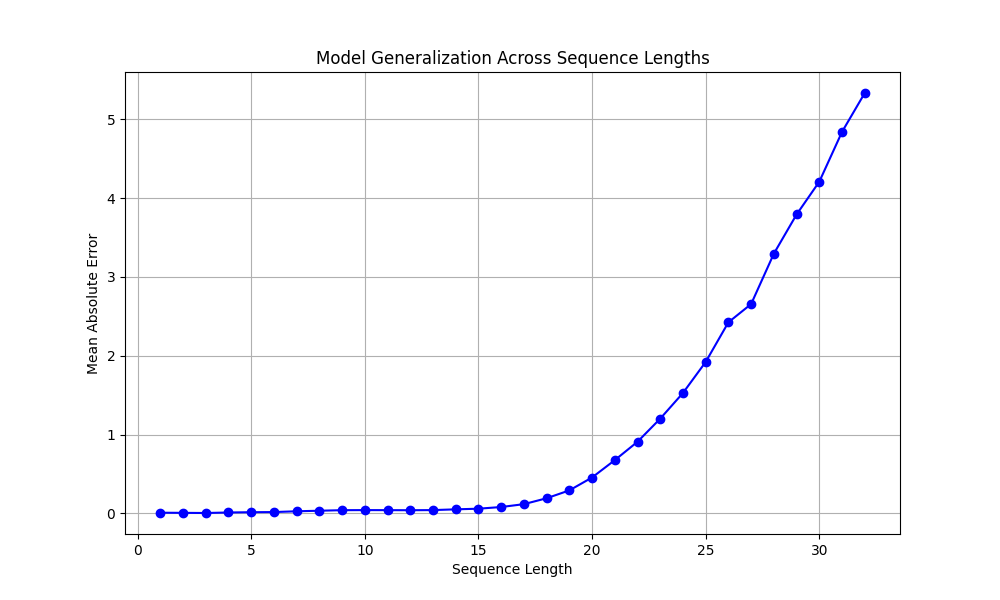 <br>

- The model generalizes the till sequence length 19-20 but after that it is not able to generalize as it has only been trained till sequence length 16.

### Optical Character Recognition

#### Task 1: Dataset

```python
def generate_word_images(word_list, image_dir, image_size=(256, 64)):
    if not os.path.exists(image_dir):
        os.makedirs(image_dir)
    for word in tqdm(word_list, desc="Generating Images"):
        img = Image.new('L', image_size, color=255)
        draw = ImageDraw.Draw(img)
        font = ImageFont.load_default()
        font_size = 24
        font = ImageFont.truetype("arial.ttf", font_size)
        bbox = draw.textbbox((0, 0), word, font=font)
        x = (image_size[0] - (bbox[2] - bbox[0])) // 2
        y = (image_size[1] - (bbox[3] - bbox[1])) // 2
        draw.text((x, y), word, font=font, fill=0)
        img.save(os.path.join(image_dir, f"{word}.png")) 

image_dir = "./../../data/external/word_images"
word_list = words.words()
word_list = list(set(word_list))
word_list = word_list[:100000]
generate_word_images(word_list, image_dir)
```

#### Task 2: Architecture

```python
class OCRDataset(Dataset):
    def __init__(self, image_paths, labels, max_length=20, num_classes=53):
        self.image_paths = image_paths
        self.labels = labels
        self.max_length = max_length
        self.num_classes = num_classes
        self.char2idx = self.create_char_map()
    
    def create_char_map(self):
        chars = '@ABCDEFGHIJKLMNOPQRSTUVWXYZabcdefghijklmnopqrstuvwxyz'
        char_map = {}
        for idx, char in enumerate(chars):
            char_map[char] = idx
        return char_map
    
    def encode_label(self, label):
        one_hot_encoded = torch.zeros((self.max_length, self.num_classes), dtype=torch.float)
        cur_label = label
        cur_len = len(label)
        cur_label = cur_label + '@' * (self.max_length - cur_len)
        for idx, char in enumerate(cur_label[:self.max_length]):
            one_hot_encoded[idx][self.char2idx[char]] = 1.0
        return one_hot_encoded

    def __len__(self):
        return len(self.image_paths)

    def __getitem__(self, idx):
        image = Image.open(self.image_paths[idx]).convert('L')
        image = torch.tensor(np.array(image), dtype=torch.float32).unsqueeze(0) / 255.0
        label = self.encode_label(self.labels[idx])
        return image, label
    

class OCRModel(nn.Module):
    def __init__(self, num_classes=53, max_length=20, hidden_dim=256, num_layers=2, dropout=0.2):
        super(OCRModel, self).__init__()
        self.num_classes = num_classes
        self.max_length = max_length
        self.hidden_dim = hidden_dim
        self.encoder = nn.Sequential(
            nn.Conv2d(1, 32, kernel_size=3, stride=1, padding=1),
            nn.ReLU(),
            nn.MaxPool2d(2, 2),
            nn.Conv2d(32, 64, kernel_size=3, stride=1, padding=1),
            nn.ReLU(),
            nn.MaxPool2d(2, 2),
            nn.Conv2d(64, 128, kernel_size=3, stride=1, padding=1),
            nn.ReLU(),
            nn.MaxPool2d(2, 2),
            nn.Conv2d(128, 256, kernel_size=3, stride=1, padding=1),
            nn.ReLU(),
            nn.MaxPool2d(2, 2)
        )
        self.flatten = nn.Flatten(start_dim=1)
        self.fc = nn.Linear(256 * 16 * 4 , hidden_dim)
        self.rnn = nn.RNN(hidden_dim, hidden_dim, num_layers=num_layers, batch_first=True, dropout=dropout)
        self.layernorm = nn.LayerNorm(hidden_dim)
        self.fc_out = nn.Linear(hidden_dim, num_classes)

    def forward(self, x):
        x = self.encoder(x)
        x = self.flatten(x)
        x = self.fc(x).unsqueeze(1).repeat(1, self.max_length, 1)
        rnn_out, _ = self.rnn(x)
        rnn_out = self.layernorm(rnn_out)
        out = self.fc_out(rnn_out)
        return out
```

#### Task 3: Training

```python
def train(model, train_loader, val_loader, criterion, optimizer, num_epochs=10, device='cuda'):
    model.to(device)
    for epoch in range(num_epochs):
        model.train()
        train_loss = 0
        train_loader_tqdm = tqdm(train_loader, desc=f"Epoch [{epoch+1}/{num_epochs}] - Training")
        
        for images, labels in train_loader_tqdm:
            images, labels = images.to(device), labels.to(device)
            optimizer.zero_grad()
            outputs = model(images)
            outputs = outputs.permute(0, 2, 1)
            labels = labels.permute(0, 2, 1)
            loss = criterion(outputs, labels)
            loss.backward()
            optimizer.step()
            train_loss += loss.item()
        
        train_loss /= len(train_loader)
        val_loss, avg_correct_chars = evaluate(model, val_loader, criterion, device)
        print(f"Epoch [{epoch+1}/{num_epochs}], Train Loss: {train_loss:.4f}, Val Loss: {val_loss:.4f}, ANCC in Val: {avg_correct_chars:.4f}")
```
Outputs

```
Epoch [1/10] - Training: 100%|██████████| 1247/1247 [02:55<00:00,  7.11it/s]
Epoch [1/10], Train Loss: 1.1071, Val Loss: 0.9058, ANCC in Val: 0.2895
Epoch [2/10] - Training: 100%|██████████| 1247/1247 [03:03<00:00,  6.78it/s]
Epoch [2/10], Train Loss: 0.6848, Val Loss: 0.4770, ANCC in Val: 0.6185
Epoch [3/10] - Training: 100%|██████████| 1247/1247 [03:00<00:00,  6.90it/s]
Epoch [3/10], Train Loss: 0.3920, Val Loss: 0.2815, ANCC in Val: 0.7729
Epoch [4/10] - Training: 100%|██████████| 1247/1247 [02:44<00:00,  7.57it/s]
Epoch [4/10], Train Loss: 0.2452, Val Loss: 0.1791, ANCC in Val: 0.8553
Epoch [5/10] - Training: 100%|██████████| 1247/1247 [02:41<00:00,  7.71it/s]
Epoch [5/10], Train Loss: 0.1737, Val Loss: 0.1249, ANCC in Val: 0.9016
Epoch [6/10] - Training: 100%|██████████| 1247/1247 [02:54<00:00,  7.15it/s]
Epoch [6/10], Train Loss: 0.1342, Val Loss: 0.0962, ANCC in Val: 0.9243
Epoch [7/10] - Training: 100%|██████████| 1247/1247 [02:29<00:00,  8.36it/s]
Epoch [7/10], Train Loss: 0.1087, Val Loss: 0.0806, ANCC in Val: 0.9367
Epoch [8/10] - Training: 100%|██████████| 1247/1247 [02:20<00:00,  8.86it/s]
Epoch [8/10], Train Loss: 0.0942, Val Loss: 0.0946, ANCC in Val: 0.9261
Epoch [9/10] - Training: 100%|██████████| 1247/1247 [02:22<00:00,  8.73it/s]
Epoch [9/10], Train Loss: 0.0823, Val Loss: 0.0745, ANCC in Val: 0.9434
Epoch [10/10] - Training: 100%|██████████| 1247/1247 [02:22<00:00,  8.73it/s]
Epoch [10/10], Train Loss: 0.0750, Val Loss: 0.0534, ANCC in Val: 0.9586
```

```
Random Baseline Accuracy: 0.0190
```

Test Set Predictions
```
nonrecent <-- True Label
nonrecent <-- Predicted Label
Ortalis <-- True Label
Ortalis <-- Predicted Label
Afrikaans <-- True Label
Arrikaans <-- Predicted Label
reposition <-- True Label
reposition <-- Predicted Label
rootling <-- True Label
rootling <-- Predicted Label
courbache <-- True Label
courbache <-- Predicted Label
wieldiness <-- True Label
wieldiness <-- Predicted Label
albiness <-- True Label
albiness <-- Predicted Label
rumbler <-- True Label
rumbler <-- Predicted Label
Centropomidae <-- True Label
Centropomidae <-- Predicted Label
pathobiology <-- True Label
pathobiology <-- Predicted Label
anoplotheroid <-- True Label
anoplotherbid <-- Predicted Label
Ptolemy <-- True Label
Ptolemy <-- Predicted Label
tredille <-- True Label
tredille <-- Predicted Label
acronyctous <-- True Label
acropyctous <-- Predicted Label
Wakore <-- True Label
Wakoze <-- Predicted Label
```

```
Test Loss: 0.0532, ANCC in Test: 0.9585
```

- The final accuracy(ANCC) that I got on train set is 95.85%.
- The final accuracy(ANCC) that I got on val set is 95.86%.

The random baseline accuracy that I got is 1.9% which is close to 100/52. This is because for each character there are 52 choices.